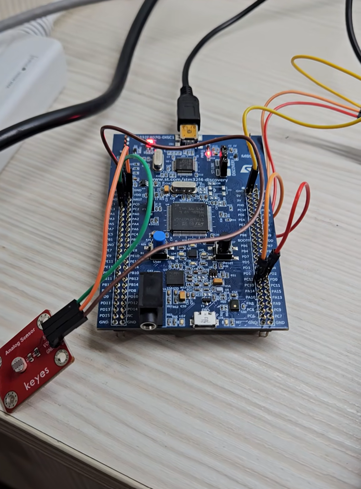

# ADC Interrupt

## Overview

This lab demonstrates how to use STM32 ADC in interrupt mode to read an analog voltage from a photoresistor circuit.

The experiment uses `PC1 / ADC1_IN11` as the ADC input pin.
The ADC reads the analog voltage from the photoresistor voltage divider circuit and converts it into a digital value.

When the ADC conversion is complete, an ADC interrupt is triggered.
Then STM32 enters `HAL_ADC_ConvCpltCallback()` to read the converted ADC value.

The converted ADC value is transmitted to the computer through UART5, so the value can be observed in a serial terminal.

In this lab, only ADC uses interrupt mode.
UART5 is still used in polling mode with `HAL_UART_Transmit()` because it is only used to print the ADC value for observation.

The main purpose of this lab is to understand the relationship between:

* Analog signal
* ADC conversion
* ADC interrupt
* ADC callback function
* UART output

In this experiment, the ADC resolution is set to 12 bits, so the ADC output value is usually in the range:

```text
0 ~ 4095
```

## Demo

This demo shows:

* Reading analog voltage from a photoresistor circuit
* ADC conversion using interrupt mode
* Entering `HAL_ADC_ConvCpltCallback()` after ADC conversion is complete
* Sending ADC value to the computer through UART5
* Observing ADC value changes when light intensity changes

[Watch the demo video](YOUR_DEMO_VIDEO_LINK)

<a href="YOUR_DEMO_VIDEO_LINK">
  
</a>

## Board / Tool

* STM32F407G-DISC1
* MCU: STM32F407VGT6U
* IDE: Keil uVision (MDK-ARM)
* Tool: STM32CubeMX
* Debugger / Programmer: ST-LINK

## ADC Pin

| Pin | Function  |
| --- | --------- |
| PC1 | ADC1_IN11 |

## UART Pins

| Pin  | Function |
| ---- | -------- |
| PC12 | UART5_TX |
| PD2  | UART5_RX |

UART5 is used to send the ADC value to the computer.

The UART setting is:

```text
115200, 8N1
```

## ADC Setting

| Item                       | Setting         |
| -------------------------- | --------------- |
| ADC                        | ADC1            |
| Channel                    | ADC1_IN11       |
| Input Pin                  | PC1             |
| Resolution                 | 12 bits         |
| Data Alignment             | Right alignment |
| Scan Conversion Mode       | Disabled        |
| Continuous Conversion Mode | Disabled        |
| DMA Continuous Requests    | Disabled        |
| External Trigger           | Software Start  |
| Number of Conversion       | 1               |

For ADC interrupt mode, the ADC global interrupt must be enabled in STM32CubeMX.

| Interrupt                             | Setting |
| ------------------------------------- | ------- |
| ADC1, ADC2 and ADC3 global interrupts | Enabled |

Since the ADC resolution is 12 bits:

```text
2^12 = 4096
```

Therefore, the ADC digital value range is usually:

```text
0 ~ 4095
```

For the STM32F407G-DISC1 board, the system voltage is mainly 3.3V.
If the ADC reference voltage is approximately 3.3V, the step voltage can be estimated as:

```text
VLSB = 3.3V / 4096
     ≈ 0.000805V
     ≈ 0.805mV
```

This means that each ADC value step represents about `0.805mV`.

## Main Concepts

* ADC converts analog voltage into digital value
* Photoresistor changes resistance according to light intensity
* Voltage divider converts resistance change into voltage change
* ADC interrupt means the callback function is executed after conversion is complete
* `HAL_ADC_ConvCpltCallback()` is called when ADC conversion is complete
* UART5 is used to print the ADC value to the computer
* UART5 transmit is still polling in this lab

## Behavior

```text
Light intensity changes
↓
Photoresistor resistance changes
↓
Voltage divider output changes
↓
ADC reads the analog voltage on PC1
↓
ADC conversion completes
↓
ADC interrupt is triggered
↓
HAL_ADC_ConvCpltCallback() is executed
↓
ADC value is sent to the computer through UART5
```

If the ADC input voltage increases:

```text
ADC value increases
```

If the ADC input voltage decreases:

```text
ADC value decreases
```

## Core Logic

```c
volatile uint16_t value = 0;
uint8_t text[20] = {0};

/* USER CODE BEGIN 2 */
HAL_ADC_Start_IT(&hadc1);
/* USER CODE END 2 */
```

```c
void HAL_ADC_ConvCpltCallback(ADC_HandleTypeDef* hadc)
{
    if (hadc->Instance == ADC1)
    {
        value = HAL_ADC_GetValue(hadc);

        sprintf((char*)text, "%d", value);

        HAL_UART_Transmit(&huart5, (uint8_t*)text, sizeof(text), 10);
        HAL_UART_Transmit(&huart5, (uint8_t*)"\r\n", 2, 10);

        HAL_ADC_Start_IT(&hadc1);
    }
}
```

## Explanation

`HAL_ADC_Start_IT()` is used to start ADC conversion in interrupt mode.

After ADC conversion is complete, the ADC interrupt is triggered, and STM32 enters:

```c
HAL_ADC_ConvCpltCallback()
```

Inside the callback function, `HAL_ADC_GetValue()` is used to read the converted ADC value.

```text
HAL_ADC_Start_IT()
↓
Start ADC conversion in interrupt mode

ADC conversion complete
↓
ADC interrupt is triggered

HAL_ADC_ConvCpltCallback()
↓
ADC conversion complete callback

HAL_ADC_GetValue()
↓
Read the converted ADC value
```

After getting the ADC value, `sprintf()` converts the number into a string.

Then `HAL_UART_Transmit()` sends the string through UART5 to the computer.

```text
ADC value
↓
sprintf()
↓
text string
↓
UART5 transmit
↓
Serial terminal
```

In this lab, UART5 transmit is still polling-based.
The main purpose of UART5 is only to print the ADC value for observation, so UART interrupt is not used here.

## Interrupt Flow

```text
Program starts
↓
HAL_ADC_Start_IT(&hadc1)
↓
Start ADC interrupt conversion
↓
ADC conversion completes
↓
ADC interrupt is triggered
↓
Enter HAL_ADC_ConvCpltCallback()
↓
Check if the interrupt source is ADC1
↓
Read ADC value
↓
Convert value to string
↓
Transmit value through UART5
↓
Restart ADC interrupt conversion
↓
Repeat
```

## Why Restart HAL_ADC_Start_IT()

In this experiment, `Continuous Conversion Mode` is disabled.

Therefore, one call of `HAL_ADC_Start_IT()` starts one ADC interrupt conversion.

```text
HAL_ADC_Start_IT()
↓
ADC performs one conversion
↓
Conversion complete
↓
Callback function is executed
↓
This conversion task ends
```

If the program needs to keep reading ADC values, it must restart ADC interrupt conversion inside the callback function:

```c
HAL_ADC_Start_IT(&hadc1);
```

This concept is similar to UART receive interrupt.

```text
UART Receive_IT:
After receiving the specified bytes, restart receive interrupt.

ADC Start_IT:
After one conversion is complete, restart ADC interrupt conversion.
```

## ADC Polling vs ADC Interrupt

| Item                  | ADC Polling                                           | ADC Interrupt                                 |
| --------------------- | ----------------------------------------------------- | --------------------------------------------- |
| Start function        | `HAL_ADC_Start()`                                     | `HAL_ADC_Start_IT()`                          |
| Waiting method        | Main program waits with `HAL_ADC_PollForConversion()` | ADC interrupt triggers after conversion       |
| Read value location   | Inside `while(1)`                                     | Inside `HAL_ADC_ConvCpltCallback()`           |
| Main program behavior | Actively waits for ADC conversion                     | Does not need to keep polling ADC             |
| Restart conversion    | Start again in `while(1)`                             | Restart with `HAL_ADC_Start_IT()` in callback |

Simple comparison:

```text
ADC Polling:
Start → Poll wait complete → GetValue

ADC Interrupt:
Start_IT → Callback after complete → GetValue → Start_IT again
```

## Note

This lab uses ADC interrupt mode, so ADC conversion completion is handled by `HAL_ADC_ConvCpltCallback()`.

UART5 is only used to print ADC values, so UART transmission still uses polling mode with `HAL_UART_Transmit()`.

This is acceptable for a basic ADC interrupt experiment.

In real applications, it is usually better to keep interrupt callback functions short and avoid doing long blocking operations inside callbacks.
