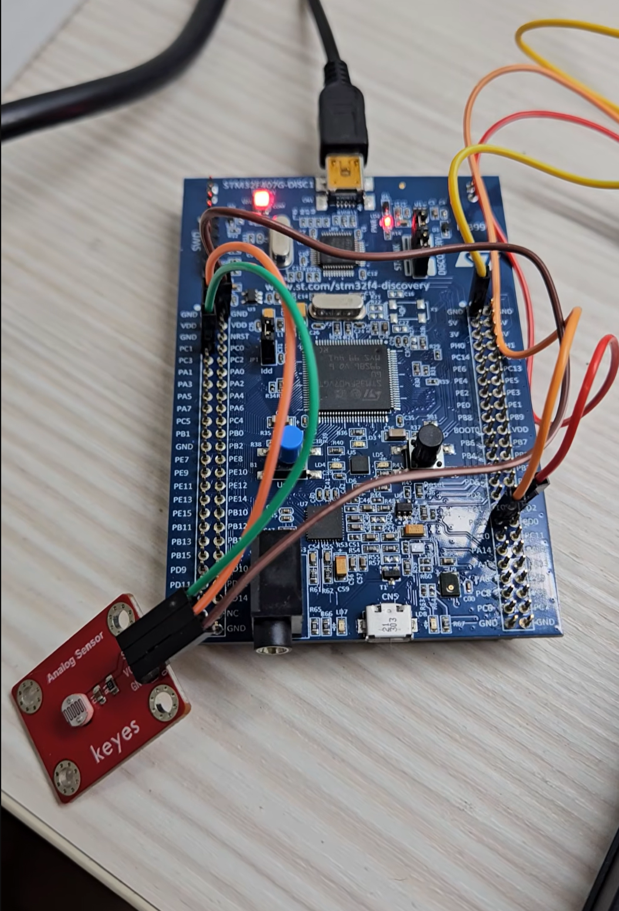

# ADC Polling

## Overview

This lab demonstrates how to use STM32 ADC in polling mode to read an analog voltage from a photoresistor circuit.

The experiment uses `PC1 / ADC1_IN11` as the ADC input pin.
The ADC reads the analog voltage from the photoresistor voltage divider circuit and converts it into a digital value.

The converted ADC value is then transmitted to the computer through UART5, so the value can be observed in a serial terminal.

The main purpose of this lab is to understand the relationship between:

* Analog signal
* ADC conversion
* ADC resolution
* Polling method
* UART output

In this experiment, the ADC resolution is set to 12 bits, so the ADC output value is usually in the range:

```text
0 ~ 4095
```

## Demo

This demo shows:

* Reading analog voltage from a photoresistor circuit
* ADC conversion using polling mode
* Sending ADC value to the computer through UART5
* Observing ADC value changes when light intensity changes

[Watch the demo video](https://youtube.com/shorts/tI2gR2pfWcE)

<a href="https://youtube.com/shorts/tI2gR2pfWcE">
  
</a>

## Board / Tool

* STM32F407G-DISC1
* MCU: STM32F407VGT6U
* IDE: Keil uVision (MDK-ARM)
* Tool: STM32CubeMX
* Debugger / Programmer: ST-LINK

## ADC Pin

| Pin | Function  |
| --- | --------- |
| PC1 | ADC1_IN11 |

## UART Pins

| Pin  | Function |
| ---- | -------- |
| PC12 | UART5_TX |
| PD2  | UART5_RX |

UART5 is used to send the ADC value to the computer.

The UART setting is:

```text
115200, 8N1
```

## ADC Setting

| Item                       | Setting         |
| -------------------------- | --------------- |
| ADC                        | ADC1            |
| Channel                    | ADC1_IN11       |
| Input Pin                  | PC1             |
| Resolution                 | 12 bits         |
| Data Alignment             | Right alignment |
| Scan Conversion Mode       | Disabled        |
| Continuous Conversion Mode | Disabled        |
| DMA Continuous Requests    | Disabled        |

Since the ADC resolution is 12 bits:

```text
2^12 = 4096
```

Therefore, the ADC digital value range is usually:

```text
0 ~ 4095
```

For the STM32F407G-DISC1 board, the system voltage is mainly 3.3V.
If the ADC reference voltage is approximately 3.3V, the step voltage can be estimated as:

```text
VLSB = 3.3V / 4096
     ≈ 0.000805V
     ≈ 0.805mV
```

This means that each ADC value step represents about `0.805mV`.

## Main Concepts

* ADC converts analog voltage into digital value
* Photoresistor changes resistance according to light intensity
* Voltage divider converts resistance change into voltage change
* ADC polling means the main program actively waits for conversion completion
* UART5 is used to print the ADC value to the computer

## Behavior

```text
Light intensity changes
↓
Photoresistor resistance changes
↓
Voltage divider output changes
↓
ADC reads the analog voltage on PC1
↓
ADC converts the voltage into a digital value
↓
UART5 sends the value to the computer
```

If the ADC input voltage increases:

```text
ADC value increases
```

If the ADC input voltage decreases:

```text
ADC value decreases
```

## Core Logic

```c
volatile uint16_t value = 0;
char text[20] = {0};

while (1)
{
    value = 0;

    HAL_ADC_Start(&hadc1);

    if (HAL_ADC_PollForConversion(&hadc1, 50) == HAL_OK)
    {
        value = HAL_ADC_GetValue(&hadc1);
    }

    sprintf(text, "%d", value);

    HAL_UART_Transmit(&huart5, (uint8_t*)text, sizeof(text), 10);
    HAL_UART_Transmit(&huart5, (uint8_t*)"\r\n", 2, 10);

    HAL_Delay(100);
}
```

## Explanation

`HAL_ADC_Start()` is used to start ADC conversion.

However, starting ADC conversion does not mean the conversion is already finished.
Therefore, `HAL_ADC_PollForConversion()` is used to wait for the ADC conversion to complete.

If the ADC conversion finishes within the timeout period, `HAL_ADC_PollForConversion()` returns `HAL_OK`.

Then `HAL_ADC_GetValue()` reads the converted ADC value.

```text
HAL_ADC_Start()
↓
Start ADC conversion

HAL_ADC_PollForConversion()
↓
Wait for ADC conversion to complete

HAL_ADC_GetValue()
↓
Read the converted ADC value
```

After getting the ADC value, `sprintf()` converts the number into a string.

Then `HAL_UART_Transmit()` sends the string through UART5 to the computer.

```text
ADC value
↓
sprintf()
↓
text string
↓
UART5 transmit
↓
Serial terminal
```

## Polling Flow

```text
while(1)
↓
Reset value to 0
↓
Start ADC conversion
↓
Wait for conversion completion
↓
If conversion is complete
↓
Read ADC value
↓
Convert value to string
↓
Transmit value through UART5
↓
Delay 100 ms
↓
Repeat
```

## Note

This lab uses ADC polling mode, so the main program actively waits for the ADC conversion to finish.

This method is simple and easy to understand, so it is suitable for basic ADC experiments.

For more advanced applications, ADC interrupt mode or DMA mode can be used to reduce CPU waiting time.
