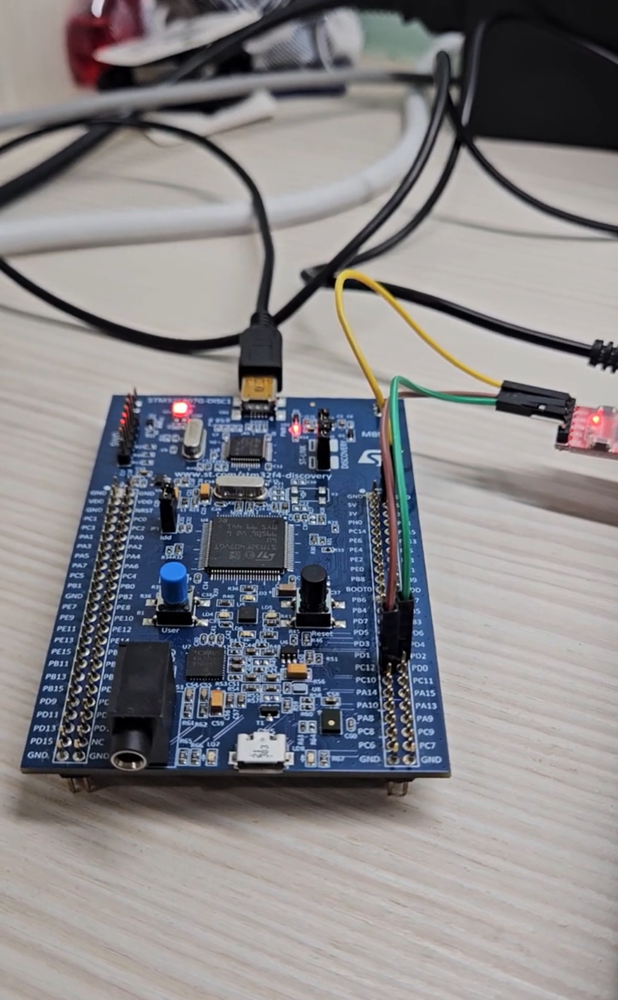

# DMA UART RX

## Overview

This lab demonstrates how to use STM32 UART RX with DMA to receive data from a computer and store the received data into a memory buffer.

The experiment uses `UART5` as the communication peripheral.

In this lab, UART5 receives data from the computer, and DMA automatically transfers the received data from the UART peripheral to the memory buffer `uRx_Data`.

The main purpose of this lab is to understand the relationship between:

* UART receive
* DMA data transfer
* Peripheral to Memory direction
* DMA transfer complete interrupt
* UART callback function
* Normal mode DMA behavior

In this experiment, the DMA receives `3 bytes` each time.

When DMA finishes transferring 3 bytes, it triggers a transfer complete interrupt.
Then STM32 enters `HAL_UART_RxCpltCallback()`.

After the received data is processed, `HAL_UART_Receive_DMA()` must be called again to restart the next DMA receive operation.

## Demo

This demo shows:

* Receiving data from the computer through UART5
* Using DMA to move UART RX data to memory
* Triggering callback after DMA receives 3 bytes
* Printing the received data back to the serial terminal
* Restarting UART RX DMA after each receive completion

[Watch the demo video](https://youtu.be/QTgikpPpF_4)

<a href="https://youtu.be/QTgikpPpF_4">
  
</a>

## Board / Tool

* STM32F407G-DISC1
* MCU: STM32F407VGT6U
* IDE: Keil uVision (MDK-ARM)
* Tool: STM32CubeMX
* Debugger / Programmer: ST-LINK

## UART Pins

| Pin  | Function |
| ---- | -------- |
| PC12 | UART5_TX |
| PD2  | UART5_RX |

UART5 is used to receive data from the computer and transmit the received result back to the serial terminal.

The UART setting is:

```text
115200, 8N1
```

## DMA Setting

| Item | Setting |
| ---- | ------- |
| DMA Request | UART5_RX |
| Direction | Peripheral To Memory |
| Mode | Normal |
| Peripheral Increment | Disabled |
| Memory Increment | Enabled |
| Peripheral Data Width | Byte |
| Memory Data Width | Byte |
| Priority | Low |

The DMA direction is:

```text
Peripheral to Memory
```

This means that the received UART data is transferred from the UART peripheral to the memory buffer.

```text
UART5 RX peripheral
↓
DMA
↓
uRx_Data[] memory buffer
```

## NVIC Setting

| Interrupt | Setting |
| --------- | ------- |
| DMA1 Stream0 global interrupt | Enabled |

In this lab, `DMA1 Stream0 global interrupt` is enabled.

When DMA finishes receiving 3 bytes, the DMA transfer complete interrupt is triggered.
Then the HAL driver handles the interrupt and calls `HAL_UART_RxCpltCallback()`.

UART5 global interrupt is not required in this basic fixed-length UART RX DMA experiment because the receive complete event is handled through the DMA interrupt path.

## Main Concepts

* DMA is used to reduce CPU involvement in data transfer
* UART5 receives data from the computer
* DMA transfers data from UART5 data register to `uRx_Data[]`
* DMA transfers one byte each time UART5 receives one byte
* The callback is called only after DMA finishes transferring the configured length
* In this lab, the configured length is 3 bytes
* Because DMA is configured in Normal mode, it must be restarted after each completed receive

## Behavior

```text
Computer sends 3 bytes
↓
UART5 receives the data
↓
UART5 generates DMA requests
↓
DMA transfers data to uRx_Data[]
↓
DMA finishes 3-byte transfer
↓
DMA transfer complete interrupt occurs
↓
HAL_UART_RxCpltCallback() is called
↓
rx_dma_done is set to 1
↓
main loop prints the received data
↓
HAL_UART_Receive_DMA() is called again
↓
Wait for the next 3 bytes
```

If the computer sends:

```text
ABC
```

STM32 sends back:

```text
UART RX DMA Complete: ABC
```

## Core Logic

### Global Variables

```c
uint8_t uRx_Data[4] = {0};
volatile uint8_t rx_dma_done = 0;
```

`uRx_Data` is the memory buffer used to store the data received by DMA.

Although this lab receives only 3 bytes, the buffer size is set to 4 bytes so that `'\0'` can be added at the end.

`rx_dma_done` is a flag used to notify the main loop that DMA reception is complete.

Because this flag is modified inside the callback function and checked inside the main loop, it is declared as `volatile`.

### Start UART RX DMA

```c
HAL_UART_Receive_DMA(&huart5, uRx_Data, 3);
```

This function starts UART5 receive using DMA.

The meaning of each parameter is:

| Parameter | Meaning |
| --------- | ------- |
| `&huart5` | Use UART5 |
| `uRx_Data` | Memory buffer used to store received data |
| `3` | Receive 3 bytes |

This can be understood as:

```text
Use UART5 to receive data
↓
Use DMA to transfer data
↓
Store the data into uRx_Data[]
↓
Receive 3 bytes in total
```

## Callback Function

```c
void HAL_UART_RxCpltCallback(UART_HandleTypeDef *huart)
{
    if (huart->Instance == UART5)
    {
        uRx_Data[3] = '\0';
        rx_dma_done = 1;
    }
}
```

When DMA finishes transferring 3 bytes, `HAL_UART_RxCpltCallback()` is called.

Inside the callback function, the program first checks whether the interrupt source is UART5.

```c
if (huart->Instance == UART5)
```

Then `'\0'` is added to the end of the buffer.

```c
uRx_Data[3] = '\0';
```

Finally, the flag is set.

```c
rx_dma_done = 1;
```

This tells the main loop that the DMA receive operation is complete and the received data can be processed.

## Main Loop

```c
if (rx_dma_done == 1)
{
    rx_dma_done = 0;

    uint8_t msg[] = "UART RX DMA Complete: ";
    uint8_t newline[] = "\r\n";

    HAL_UART_Transmit(&huart5, msg, sizeof(msg) - 1, 100);
    HAL_UART_Transmit(&huart5, uRx_Data, 3, 100);
    HAL_UART_Transmit(&huart5, newline, sizeof(newline) - 1, 100);

    memset(uRx_Data, 0, sizeof(uRx_Data));

    HAL_UART_Receive_DMA(&huart5, uRx_Data, 3);
}
```

When `rx_dma_done` becomes 1, the main loop starts processing the received data.

First, the flag is cleared.

```c
rx_dma_done = 0;
```

Then UART5 sends a message and prints the received 3 bytes.

```c
HAL_UART_Transmit(&huart5, msg, sizeof(msg) - 1, 100);
HAL_UART_Transmit(&huart5, uRx_Data, 3, 100);
HAL_UART_Transmit(&huart5, newline, sizeof(newline) - 1, 100);
```

After printing the received data, the buffer is cleared.

```c
memset(uRx_Data, 0, sizeof(uRx_Data));
```

Finally, UART RX DMA is started again.

```c
HAL_UART_Receive_DMA(&huart5, uRx_Data, 3);
```

This step is important because this lab uses DMA Normal mode.

In Normal mode, DMA stops after receiving the configured length.
Therefore, if the program needs to receive the next 3 bytes, `HAL_UART_Receive_DMA()` must be called again.

## DMA Receive Flow

```text
HAL_UART_Receive_DMA(&huart5, uRx_Data, 3)
↓
UART5 waits for received data
↓
UART5 receives 1 byte
↓
UART5 generates DMA request
↓
DMA transfers data to uRx_Data[0]
↓
UART5 receives another byte
↓
DMA transfers data to uRx_Data[1]
↓
UART5 receives another byte
↓
DMA transfers data to uRx_Data[2]
↓
DMA finishes 3-byte transfer
↓
DMA transfer complete interrupt occurs
↓
HAL_UART_RxCpltCallback() is called
↓
rx_dma_done = 1
↓
main loop prints received data
↓
restart HAL_UART_Receive_DMA()
```

## Explanation

`HAL_UART_Receive_DMA()` is used to start UART receive with DMA.

```c
HAL_UART_Receive_DMA(&huart5, uRx_Data, 3);
```

The third parameter `3` means that DMA will transfer 3 bytes.

It does not mean DMA starts only after 3 bytes are received.

Instead, UART5 generates a DMA request each time it receives one byte.
Then DMA transfers that byte from the UART data register to the memory buffer.

After DMA transfers 3 bytes in total, the transfer complete interrupt is triggered.

```text
UART5 receives 1 byte
↓
DMA transfers 1 byte

UART5 receives another byte
↓
DMA transfers another byte

UART5 receives another byte
↓
DMA transfers another byte

Total = 3 bytes
↓
DMA transfer complete interrupt
↓
Callback function
```

## Normal Mode Note

This lab uses DMA Normal mode.

In Normal mode:

```text
DMA receives configured length
↓
DMA stops
↓
CPU is notified
```

Therefore, after DMA receives 3 bytes, it will stop.

If the program does not call `HAL_UART_Receive_DMA()` again, UART RX DMA will only work once.

To receive data repeatedly, the program must restart DMA after each completed receive.

```c
HAL_UART_Receive_DMA(&huart5, uRx_Data, 3);
```

## Note

This lab demonstrates fixed-length UART RX DMA.

Since the receive length is fixed to 3 bytes, the serial terminal should send exactly 3 bytes during testing.

If the terminal automatically sends `\r\n` after pressing Enter, the extra characters may be received by the next DMA receive operation.

For variable-length UART data, `HAL_UARTEx_ReceiveToIdle_DMA()` can be used in a more advanced experiment.

## Summary

```text
DMA_UART_RX uses UART5 to receive data.

DMA transfers UART5 received data to uRx_Data[].

The transfer direction is Peripheral to Memory.

DMA transfers each byte when UART5 receives data.

After DMA transfers 3 bytes, the transfer complete interrupt is triggered.

Then HAL_UART_RxCpltCallback() is called.

Because this lab uses Normal mode, DMA must be restarted after every completed receive.
```
