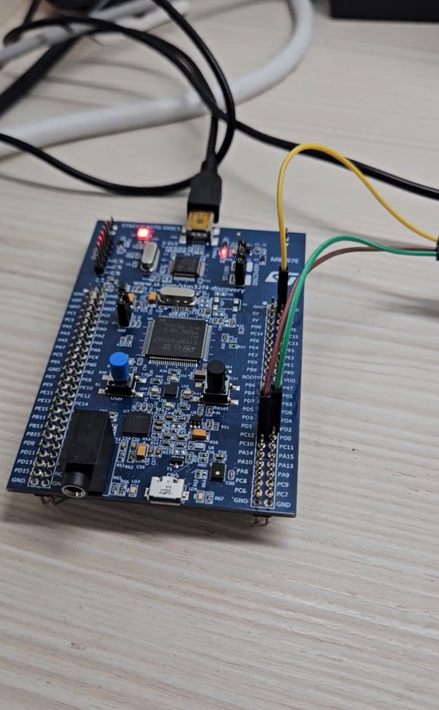

# DMA UART TX

## Overview

This lab demonstrates how to use STM32 UART TX with DMA to transmit data from a memory buffer to the computer through UART5.

The experiment uses `UART5` as the communication peripheral.

In this lab, the message data is stored in a memory buffer called `txData`.
DMA automatically transfers the data from memory to the UART5 peripheral.
Then UART5 transmits the data to the computer through the TX pin.

The main purpose of this lab is to understand the relationship between:

* UART transmit
* DMA data transfer
* Memory to Peripheral direction
* DMA transfer complete
* UART transmission complete
* UART TX complete callback
* Normal mode DMA behavior

In this experiment, STM32 repeatedly sends the following message through UART5:

```text
Hello from UART TX DMA!
```

## Demo

This demo shows:

* Sending a string from STM32 to the computer through UART5
* Using DMA to move data from memory to UART5
* UART5 transmitting the data to the serial terminal
* Repeating the transmission every 1 second
* Using `HAL_UART_TxCpltCallback()` to check when transmission is complete

[Watch the demo video](https://youtu.be/your_video_link)

<a href="https://youtu.be/your_video_link">
  
</a>

## Board / Tool

* STM32F407G-DISC1
* MCU: STM32F407VGT6U
* IDE: Keil uVision (MDK-ARM)
* Tool: STM32CubeMX
* Debugger / Programmer: ST-LINK

## UART Pins

| Pin  | Function |
| ---- | -------- |
| PC12 | UART5_TX |
| PD2  | UART5_RX |

UART5 is used to send data from STM32 to the computer.

The UART setting is:

```text
115200, 8N1
```

## DMA Setting

| Item | Setting |
| ---- | ------- |
| DMA Request | UART5_TX |
| Direction | Memory To Peripheral |
| Mode | Normal |
| Peripheral Increment | Disabled |
| Memory Increment | Enabled |
| Peripheral Data Width | Byte |
| Memory Data Width | Byte |
| Priority | Low |

The DMA direction is:

```text
Memory to Peripheral
```

This means that the data is transferred from the memory buffer to the UART peripheral.

```text
txData[] memory buffer
↓
DMA
↓
UART5 TX peripheral
↓
TX pin
↓
Serial terminal
```

## NVIC Setting

| Interrupt | Setting |
| --------- | ------- |
| DMA1 Stream7 global interrupt | Enabled |
| UART5 global interrupt | Enabled |

In this lab, both `DMA1 Stream7 global interrupt` and `UART5 global interrupt` are enabled.

The DMA interrupt is used to indicate that DMA has finished moving data from memory to UART.

The UART interrupt is used to confirm that UART has really finished transmitting the last byte through the TX pin.

```text
DMA interrupt:
Data has been moved to UART.

UART interrupt:
Data has really been transmitted out through TX.
```

## Main Concepts

* DMA is used to reduce CPU involvement in UART transmission
* `txData[]` is the memory buffer containing the message
* DMA transfers data from `txData[]` to the UART5 data register
* UART5 transmits the data from the TX pin
* DMA transfer complete does not always mean UART transmission is fully complete
* UART transmission complete means the last byte has really been sent out
* `HAL_UART_TxCpltCallback()` is called when UART TX DMA transmission is complete
* Because DMA is configured in Normal mode, the transmit function must be called again for the next transmission

## Behavior

```text
txData[] stores the message
↓
main loop checks tx_dma_done
↓
HAL_UART_Transmit_DMA() starts UART TX DMA
↓
DMA transfers data from txData[] to UART5
↓
UART5 sends data through TX pin
↓
UART transmission complete interrupt occurs
↓
HAL_UART_TxCpltCallback() is called
↓
tx_dma_done is set to 1
↓
main loop starts the next transmission
```

The serial terminal repeatedly shows:

```text
Hello from UART TX DMA!
Hello from UART TX DMA!
Hello from UART TX DMA!
Hello from UART TX DMA!
```

## Core Logic

### Global Variables

```c
uint8_t txData[] = "Hello from UART TX DMA!\r\n";
volatile uint8_t tx_dma_done = 1;
```

`txData[]` is the memory buffer that stores the message to be transmitted.

This buffer is the data source for DMA.

```text
txData[]
↓
DMA
↓
UART5 data register
```

`tx_dma_done` is a flag used to control whether the next UART TX DMA transmission can start.

It is initialized to `1`, so the first transmission can start immediately.

Because this flag is modified inside the callback function and checked inside the main loop, it is declared as `volatile`.

## Start UART TX DMA

```c
if (tx_dma_done == 1)
{
    tx_dma_done = 0;

    if (HAL_UART_Transmit_DMA(&huart5, txData, sizeof(txData) - 1) != HAL_OK)
    {
        Error_Handler();
    }

    HAL_Delay(1000);
}
```

When `tx_dma_done` is `1`, the program starts a new UART TX DMA transmission.

Before starting transmission, the flag is cleared:

```c
tx_dma_done = 0;
```

This means that UART TX DMA is currently running.

The core function is:

```c
HAL_UART_Transmit_DMA(&huart5, txData, sizeof(txData) - 1);
```

The meaning of each parameter is:

| Parameter | Meaning |
| --------- | ------- |
| `&huart5` | Use UART5 |
| `txData` | Memory buffer to transmit |
| `sizeof(txData) - 1` | Data length, excluding the final `'\0'` |

This can be understood as:

```text
Use UART5 to transmit data
↓
Use DMA to move data
↓
Move data from txData[] to UART5
↓
UART5 sends data to the computer
```

`HAL_UART_Transmit_DMA()` returning `HAL_OK` means that the UART TX DMA transmission task was successfully started.

It does not mean that all data has already been transmitted.

The actual transmission completion is handled by:

```c
HAL_UART_TxCpltCallback()
```

## Callback Function

```c
void HAL_UART_TxCpltCallback(UART_HandleTypeDef *huart)
{
    if (huart->Instance == UART5)
    {
        tx_dma_done = 1;
    }
}
```

When UART5 TX DMA transmission is complete, `HAL_UART_TxCpltCallback()` is called.

Inside the callback function, the program first checks whether the source is UART5.

```c
if (huart->Instance == UART5)
```

Then the flag is set to 1.

```c
tx_dma_done = 1;
```

This tells the main loop that the current UART TX DMA transmission is complete and the next transmission can start.

## UART TX DMA Flow

```text
txData[] contains the message
↓
main loop sees tx_dma_done == 1
↓
tx_dma_done = 0
↓
HAL_UART_Transmit_DMA() starts UART TX DMA
↓
DMA reads data from txData[]
↓
DMA writes data to UART5 data register
↓
UART5 transmits data through TX pin
↓
UART TX DMA transmission completes
↓
HAL_UART_TxCpltCallback() is called
↓
tx_dma_done = 1
↓
Delay about 1 second
↓
Repeat
```

## Explanation

`HAL_UART_Transmit_DMA()` is used to start UART transmission with DMA.

```c
HAL_UART_Transmit_DMA(&huart5, txData, sizeof(txData) - 1);
```

In this lab, DMA transfers data from memory to UART5.

```text
Memory buffer
↓
DMA
↓
UART5 data register
```

UART5 then sends the data through the TX pin.

```text
UART5 data register
↓
UART hardware
↓
TX pin
↓
Serial terminal
```

DMA and UART work together.

DMA is responsible for moving data to UART.

UART is responsible for actually transmitting the data.

```text
DMA:
Move data to UART.

UART:
Send data out through TX.
```

## DMA Transfer Complete vs UART Transmission Complete

DMA transfer complete and UART transmission complete are not exactly the same.

DMA transfer complete means:

```text
DMA has moved all data from memory to UART.
```

UART transmission complete means:

```text
UART has really transmitted the last byte through the TX pin.
```

So they can be understood as:

```text
DMA interrupt:
I have finished moving the data.

UART interrupt:
I have really finished sending the data.
```

DMA may finish moving data before UART finishes sending the last byte.

Therefore, in UART TX DMA, UART global interrupt is also enabled to confirm the final transmission completion.

## Why Use sizeof(txData) - 1

```c
HAL_UART_Transmit_DMA(&huart5, txData, sizeof(txData) - 1);
```

`txData` is a C string.

```c
uint8_t txData[] = "Hello from UART TX DMA!\r\n";
```

A C string automatically includes a final `'\0'`.

However, `'\0'` is only used as the string terminator in C.
It does not need to be transmitted to the serial terminal.

Therefore, this lab uses:

```c
sizeof(txData) - 1
```

to exclude the final `'\0'`.

## Normal Mode Note

This lab uses DMA Normal mode.

In Normal mode:

```text
DMA transfers the configured length
↓
DMA stops
↓
CPU is notified
```

Therefore, each call to `HAL_UART_Transmit_DMA()` starts one transmission task.

After the transmission is complete, if the program wants to transmit again, it must call `HAL_UART_Transmit_DMA()` again.

In this lab, the main loop uses `tx_dma_done` to control when the next transmission can start.

## Summary

```text
DMA_UART_TX uses UART5 to transmit data.

txData[] is the memory buffer that stores the message.

DMA transfers data from txData[] to UART5.

The transfer direction is Memory to Peripheral.

UART5 transmits the data through the TX pin.

DMA is responsible for moving data.

UART is responsible for sending data.

DMA transfer complete means the data has been moved to UART.

UART transmission complete means the data has really been sent out.

HAL_UART_TxCpltCallback() sets tx_dma_done to 1.

Because this lab uses Normal mode, each transmission must be started again by HAL_UART_Transmit_DMA().
```
