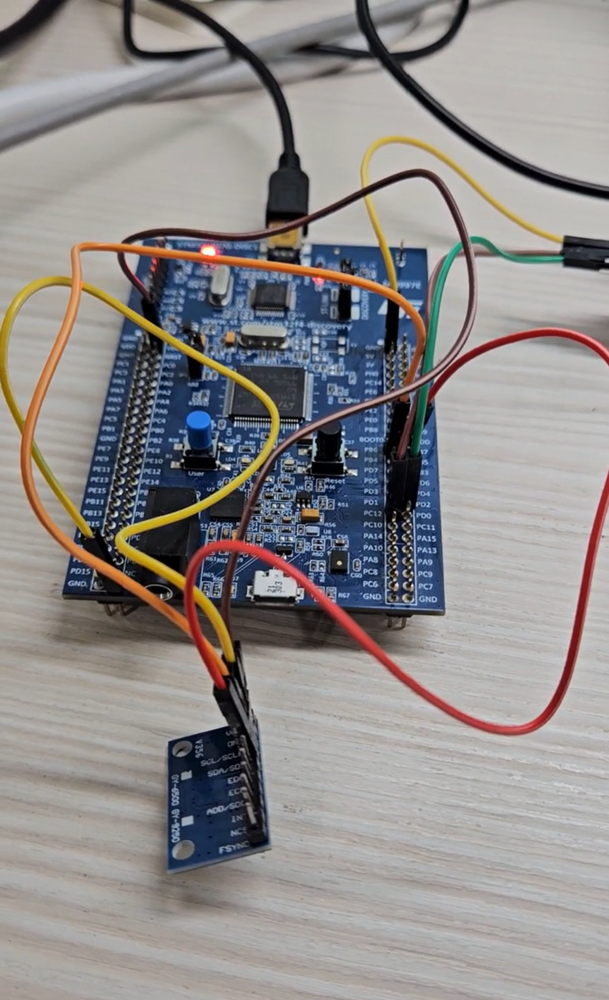

# I2C Interrupt

## Overview

This lab demonstrates how to use STM32 I2C in interrupt mode to read acceleration data from an MPU6500 sensor.

This project is modified from the previous I2C polling lab.

In this lab, the initialization part still uses polling mode:

```text
1. Read WHO_AM_I register using polling
2. Write PWR_MGMT_1 register using polling
3. Read back PWR_MGMT_1 using polling
```

The main interrupt part is used for reading acceleration data:

```text
Read ACCEL_X / ACCEL_Y / ACCEL_Z using I2C interrupt mode
```

When the I2C acceleration read is complete, an I2C interrupt is triggered.
Then STM32 enters `HAL_I2C_MemRxCpltCallback()` and sets a flag.

The main program checks this flag in `while(1)`, combines the high byte and low byte, and prints the raw acceleration values through UART5.

In this lab, only the acceleration data read uses I2C interrupt mode.
UART5 is still used in polling mode with `HAL_UART_Transmit()` because it is only used to print messages for observation.

The main purpose of this lab is to understand:

* I2C communication
* I2C interrupt read
* I2C callback function
* MPU6500 register read
* Flag-based interrupt handling
* UART output for debugging

## Demo

This demo shows:

* Reading `WHO_AM_I` from MPU6500 using polling
* Writing `PWR_MGMT_1 = 0x00` using polling
* Starting I2C acceleration read using interrupt mode
* Entering `HAL_I2C_MemRxCpltCallback()` after I2C read is complete
* Using `accelReady` flag to process acceleration data in `while(1)`
* Sending ACCEL_X / ACCEL_Y / ACCEL_Z raw data to the computer through UART5

[Watch the demo video](https://youtu.be/oVgamOqKJ5Q)

<a href="https://youtu.be/oVgamOqKJ5Q">
  
</a>

## Board / Tool

* STM32F407G-DISC1
* MCU: STM32F407VGT6U
* IDE: Keil uVision (MDK-ARM)
* Tool: STM32CubeMX
* Debugger / Programmer: ST-LINK

## I2C Pins

This lab uses `I2C1`.

| Pin | Function |
| --- | -------- |
| PB6 | I2C1_SCL |
| PB7 | I2C1_SDA |

## UART Pins

UART5 is used to send the result to the computer.

| Pin  | Function |
| ---- | -------- |
| PC12 | UART5_TX |
| PD2  | UART5_RX |

The UART setting is:

```text
115200, 8N1
```

## Hardware Connection

| STM32F407G-DISC1 | MPU6500 |
| ---------------- | ------- |
| PB6 / I2C1_SCL   | SCL     |
| PB7 / I2C1_SDA   | SDA     |
| GND              | GND     |
| 3.3V / VDD       | VCC     |

I2C uses two main signal lines:

```text
SCL: clock line
SDA: data line
```

Since STM32F407 uses 3.3V logic level, the I2C SCL / SDA lines should also be kept at 3.3V logic level.

## I2C Setting

| Item           | Setting       |
| -------------- | ------------- |
| I2C            | I2C1          |
| SCL            | PB6           |
| SDA            | PB7           |
| Speed Mode     | Standard Mode |
| Clock Speed    | 100 kHz       |
| Address Length | 7-bit         |

For I2C interrupt mode, the I2C1 event interrupt and error interrupt must be enabled in STM32CubeMX.

| Interrupt            | Setting |
| -------------------- | ------- |
| I2C1 event interrupt | Enabled |
| I2C1 error interrupt | Enabled |

## MPU6500 Registers

The following registers are used in this lab:

| Name         | Address | Description                        |
| ------------ | ------- | ---------------------------------- |
| WHO_AM_I     | 0x75    | Used to identify MPU6500           |
| PWR_MGMT_1   | 0x6B    | Power management register          |
| ACCEL_XOUT_H | 0x3B    | Start address of acceleration data |

The MPU6500 7-bit I2C slave address is `0x68`.

In STM32 HAL, the I2C address is usually shifted left by 1 bit:

```c
#define MPU6500_ADDRESS     (0x68 << 1)
#define WHO_AM_I_MPU6500    0x75
#define PWR_MGMT_1          0x6B
#define ACCEL_XOUT_H        0x3B
```

The address is shifted left because the lowest bit is used for the read / write bit in I2C communication.

The actual read / write bit is handled by HAL when calling `HAL_I2C_Mem_Read()`, `HAL_I2C_Mem_Write()`, or `HAL_I2C_Mem_Read_IT()`.

## Main Concepts

* I2C allows multiple slave devices to share the same SCL and SDA bus
* The master uses the slave address to select which device to communicate with
* `HAL_I2C_Mem_Read()` is used for polling register read
* `HAL_I2C_Mem_Write()` is used for polling register write
* `HAL_I2C_Mem_Read_IT()` is used to start an I2C interrupt read task
* `HAL_I2C_MemRxCpltCallback()` is called when the I2C memory read is complete
* `HAL_I2C_ErrorCallback()` is called when an I2C error occurs
* The callback only sets a flag
* The main program processes the acceleration data in `while(1)`
* UART5 is used to print the result to the computer

## Behavior

```text
Program starts
↓
Read WHO_AM_I using polling
↓
If WHO_AM_I = 0x70
↓
MPU6500 is detected
↓
Write PWR_MGMT_1 = 0x00 using polling
↓
Read back PWR_MGMT_1 using polling
↓
Start I2C interrupt read for acceleration data
↓
I2C read complete interrupt occurs
↓
HAL_I2C_MemRxCpltCallback() is executed
↓
accelReady flag is set to 1
↓
while(1) checks accelReady
↓
Combine high byte and low byte
↓
Print ACCEL_X / ACCEL_Y / ACCEL_Z through UART5
↓
Start the next I2C interrupt read
```

## Core Logic

### Global Variables

```c
uint8_t readData = 0;
uint8_t writeData = 0;
uint8_t accelData[6] = {0};

int16_t accelX = 0;
int16_t accelY = 0;
int16_t accelZ = 0;

char msg[128];

volatile uint8_t accelReady = 0;
volatile uint8_t i2cError = 0;
```

`accelReady` and `i2cError` are declared as `volatile` because they are modified inside callback functions and checked inside the main loop.

### Start I2C Interrupt Read

```c
static void Start_Accel_Read_IT(void)
{
    HAL_StatusTypeDef ret;

    ret = HAL_I2C_Mem_Read_IT(&hi2c1,
                              MPU6500_ADDRESS,
                              ACCEL_XOUT_H,
                              I2C_MEMADD_SIZE_8BIT,
                              accelData,
                              6);

    if (ret == HAL_OK)
    {
        UART_Print("Start I2C interrupt read success.\r\n");
    }

    if (ret != HAL_OK)
    {
        UART_Print("Start I2C interrupt read failed.\r\n");
    }
}
```

`HAL_I2C_Mem_Read_IT()` starts one I2C memory read task in interrupt mode.

It does not mean the data has already been read.
It only means the I2C interrupt read task has been started.

The program reads 6 bytes starting from `ACCEL_XOUT_H` because each axis uses 2 bytes:

```text
ACCEL_X = 2 bytes
ACCEL_Y = 2 bytes
ACCEL_Z = 2 bytes
```

The data order is:

```text
accelData[0] = ACCEL_XOUT_H
accelData[1] = ACCEL_XOUT_L

accelData[2] = ACCEL_YOUT_H
accelData[3] = ACCEL_YOUT_L

accelData[4] = ACCEL_ZOUT_H
accelData[5] = ACCEL_ZOUT_L
```

### I2C Read Complete Callback

```c
void HAL_I2C_MemRxCpltCallback(I2C_HandleTypeDef *hi2c)
{
    if (hi2c->Instance == I2C1)
    {
        accelReady = 1;
    }
}
```

When the I2C interrupt read is complete, STM32 enters `HAL_I2C_MemRxCpltCallback()`.

In this callback, the program only sets:

```c
accelReady = 1;
```

The acceleration data is not processed inside the callback.
The data processing is done in `while(1)`.

This keeps the callback function short and simple.

### I2C Error Callback

```c
void HAL_I2C_ErrorCallback(I2C_HandleTypeDef *hi2c)
{
    if (hi2c->Instance == I2C1)
    {
        i2cError = 1;
    }
}
```

If an I2C error occurs, STM32 enters `HAL_I2C_ErrorCallback()`.

In this callback, the program only sets:

```c
i2cError = 1;
```

The error message and restart operation are handled in `while(1)`.

### Main Loop

```c
if (accelReady)
{
    accelReady = 0;

    accelX = (int16_t)(((uint16_t)accelData[0] << 8) | accelData[1]);
    accelY = (int16_t)(((uint16_t)accelData[2] << 8) | accelData[3]);
    accelZ = (int16_t)(((uint16_t)accelData[4] << 8) | accelData[5]);

    snprintf(msg, sizeof(msg),
             "ACCEL_X = %d, ACCEL_Y = %d, ACCEL_Z = %d\r\n",
             accelX, accelY, accelZ);

    UART_Print(msg);

    HAL_Delay(500);

    Start_Accel_Read_IT();
}
```

When `accelReady` becomes 1, it means the I2C interrupt read is complete.

The program clears the flag first:

```c
accelReady = 0;
```

Then the high byte and low byte are combined into a 16-bit signed value:

```c
accelX = (int16_t)(((uint16_t)accelData[0] << 8) | accelData[1]);
accelY = (int16_t)(((uint16_t)accelData[2] << 8) | accelData[3]);
accelZ = (int16_t)(((uint16_t)accelData[4] << 8) | accelData[5]);
```

After printing the acceleration values, the program calls `Start_Accel_Read_IT()` again to start the next I2C interrupt read.

The printed values are raw acceleration data, not converted g values.

### Error Handling

```c
if (i2cError)
{
    i2cError = 0;

    UART_Print("I2C error occurred.\r\n");

    HAL_Delay(1000);

    Start_Accel_Read_IT();
}
```

If an I2C error occurs, the program clears the `i2cError` flag, prints an error message, waits for 1000 ms, and starts another I2C interrupt read.

## Explanation

`HAL_I2C_Mem_Read_IT()` is used to start I2C memory read in interrupt mode.

```text
HAL_I2C_Mem_Read_IT()
↓
Start one I2C interrupt read task
↓
I2C1 hardware communicates with MPU6500 through SCL / SDA
↓
CPU does not need to wait inside the function
↓
When the read is complete, I2C interrupt is triggered
↓
HAL_I2C_MemRxCpltCallback() is called
```

This is different from polling mode.

Polling mode uses:

```c
HAL_I2C_Mem_Read(..., 100);
```

The final parameter `100` is the timeout value.
The main program waits until the I2C transfer is complete or timeout occurs.

Interrupt mode uses:

```c
HAL_I2C_Mem_Read_IT(...);
```

There is no timeout parameter.
The function only starts the I2C interrupt read task.
When the read is complete, the callback function is called.

## Interrupt Flow

```text
Program starts
↓
Read WHO_AM_I using polling
↓
Write PWR_MGMT_1 using polling
↓
Start_Accel_Read_IT()
↓
HAL_I2C_Mem_Read_IT() starts one I2C interrupt read task
↓
I2C1 reads 6 bytes from MPU6500
↓
I2C read complete interrupt is triggered
↓
Enter HAL_I2C_MemRxCpltCallback()
↓
Set accelReady = 1
↓
Return to main program
↓
while(1) detects accelReady
↓
Clear accelReady
↓
Combine high byte and low byte
↓
Print ACCEL_X / ACCEL_Y / ACCEL_Z through UART5
↓
Delay 500 ms
↓
Start_Accel_Read_IT() again
↓
Repeat
```

## Why Restart HAL_I2C_Mem_Read_IT()

In this lab, one call of `HAL_I2C_Mem_Read_IT()` starts one I2C interrupt read task.

```text
HAL_I2C_Mem_Read_IT()
↓
Start one I2C interrupt read task
↓
Read 6 bytes from MPU6500
↓
Read complete callback is executed
↓
This read task ends
```

If the program needs to keep reading acceleration data, it must restart the I2C interrupt read after one read is complete:

```c
Start_Accel_Read_IT();
```

This concept is similar to UART receive interrupt.

```text
UART Receive_IT:
After receiving the specified bytes, restart receive interrupt.

I2C Mem_Read_IT:
After reading the specified bytes, restart I2C interrupt read.
```

In this demo, the message:

```text
Start I2C interrupt read success.
```

is kept to show that each I2C interrupt read task is restarted after the previous read is complete.

## I2C Polling vs I2C Interrupt

| Item                     | I2C Polling                                                   | I2C Interrupt                                       |
| ------------------------ | ------------------------------------------------------------- | --------------------------------------------------- |
| Read function            | `HAL_I2C_Mem_Read()`                                          | `HAL_I2C_Mem_Read_IT()`                             |
| Waiting method           | Main program waits until transfer completes or timeout occurs | Callback is called after transfer completes         |
| Timeout parameter        | Required                                                      | Not used                                            |
| Data processing location | Usually inside `while(1)` after read returns                  | In `while(1)` after callback sets a flag            |
| Callback function        | Not used                                                      | `HAL_I2C_MemRxCpltCallback()`                       |
| Restart read             | Call read function again in main loop                         | Call `HAL_I2C_Mem_Read_IT()` again after completion |

Simple comparison:

```text
I2C Polling:
Mem_Read → Wait until complete → Process data

I2C Interrupt:
Mem_Read_IT → Callback after complete → Set flag → Process data → Mem_Read_IT again
```

## Note

This lab uses I2C interrupt mode only for reading acceleration data.

The `WHO_AM_I` check and `PWR_MGMT_1` write / read-back are still done using polling mode, so the initialization process is simple and easy to understand.

UART5 is only used to print messages and acceleration values, so UART transmission still uses polling mode with `HAL_UART_Transmit()`.

In real applications, it is usually better to keep interrupt callback functions short and avoid doing long blocking operations inside callbacks.

Therefore, this lab only sets flags inside the I2C callback functions and handles UART output in the main loop.
