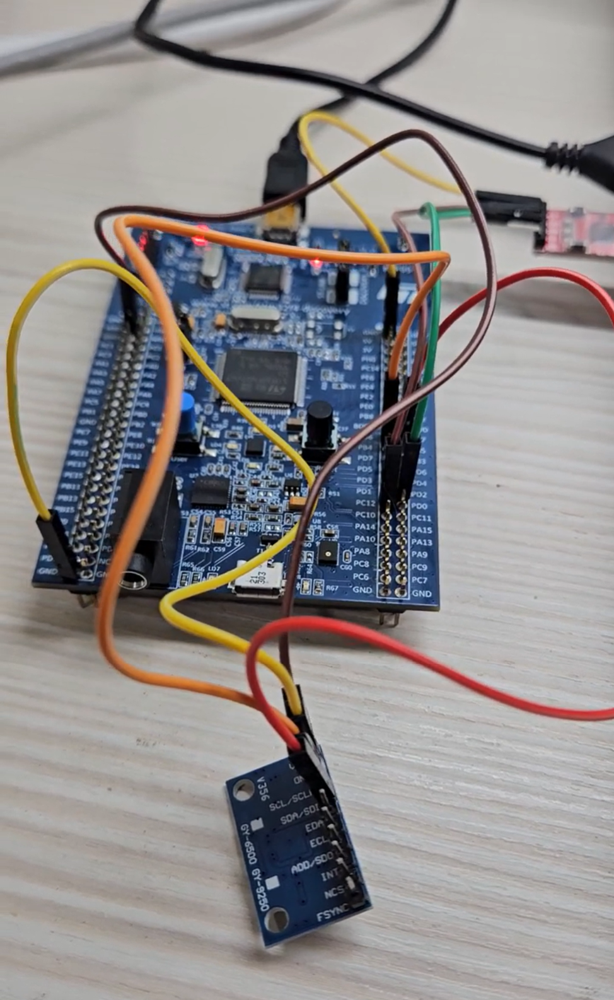

# I2C Polling

## Overview

This lab demonstrates how to use STM32 I2C in polling mode to communicate with an MPU6500 sensor.

The experiment uses `I2C1` to read and write registers inside the MPU6500.
The result is transmitted to the computer through UART5, so the I2C communication result can be observed in a serial terminal.

The main purpose of this lab is to understand:

* I2C communication
* I2C polling method
* I2C slave address
* MPU6500 register read / write
* UART output for debugging

This experiment is divided into three main parts:

```text
1. Read WHO_AM_I register to check whether MPU6500 can be detected
2. Write PWR_MGMT_1 register and read it back to check I2C write
3. Read ACCEL_X / ACCEL_Y / ACCEL_Z raw acceleration data
```

## Demo

This demo shows:

* Reading `WHO_AM_I` from MPU6500
* Writing `PWR_MGMT_1`
* Reading back `PWR_MGMT_1`
* Reading X / Y / Z acceleration raw data
* Sending the result to the computer through UART5

[Watch the demo video](YOUR_DEMO_VIDEO_URL)

<a href="YOUR_DEMO_VIDEO_URL">
  
</a>

## Board / Tool

* STM32F407G-DISC1
* MCU: STM32F407VGT6U
* IDE: Keil uVision (MDK-ARM)
* Tool: STM32CubeMX
* Debugger / Programmer: ST-LINK

## I2C Pins

This lab uses `I2C1`.

| Pin | Function |
| --- | -------- |
| PB6 | I2C1_SCL |
| PB7 | I2C1_SDA |

## UART Pins

UART5 is used to send the result to the computer.

| Pin  | Function |
| ---- | -------- |
| PC12 | UART5_TX |
| PD2  | UART5_RX |

The UART setting is:

```text
115200, 8N1
```

## Hardware Connection

| STM32F407G-DISC1 | MPU6500 |
| ---------------- | ------- |
| PB6 / I2C1_SCL   | SCL     |
| PB7 / I2C1_SDA   | SDA     |
| GND              | GND     |
| 3.3V / VDD       | VCC     |

I2C uses two main signal lines:

```text
SCL: clock line
SDA: data line
```

Since STM32F407 uses 3.3V logic level, the I2C SCL / SDA lines should also be kept at 3.3V logic level.

## I2C Setting

| Item           | Setting       |
| -------------- | ------------- |
| I2C            | I2C1          |
| SCL            | PB6           |
| SDA            | PB7           |
| Speed Mode     | Standard Mode |
| Clock Speed    | 100 kHz       |
| Address Length | 7-bit         |

## MPU6500 Registers

The following registers are used in this lab:

| Name         | Address | Description                        |
| ------------ | ------- | ---------------------------------- |
| WHO_AM_I     | 0x75    | Used to identify MPU6500           |
| PWR_MGMT_1   | 0x6B    | Power management register          |
| ACCEL_XOUT_H | 0x3B    | Start address of acceleration data |

The MPU6500 7-bit I2C slave address is `0x68`.

In STM32 HAL, the I2C address is usually shifted left by 1 bit:

```c
#define MPU6500_ADDRESS     (0x68 << 1)
#define WHO_AM_I_MPU6500    0x75
#define PWR_MGMT_1          0x6B
#define ACCEL_XOUT_H        0x3B
```

The address is shifted left because the lowest bit is used for the read / write bit in I2C communication.

The actual read / write bit is handled by HAL when calling `HAL_I2C_Mem_Read()` or `HAL_I2C_Mem_Write()`.

## Main Concepts

* I2C allows multiple slave devices to share the same SCL and SDA bus
* The master uses a slave address to select which device to communicate with
* `HAL_I2C_Mem_Read()` is used to read a register inside the MPU6500
* `HAL_I2C_Mem_Write()` is used to write data into a register inside the MPU6500
* Polling mode means the program waits until the I2C transfer is complete or timeout occurs
* UART5 is used to print the result to the computer

## Behavior

```text
Start program
↓
Read WHO_AM_I register
↓
If WHO_AM_I = 0x70
↓
MPU6500 is detected
↓
Write PWR_MGMT_1 = 0x00
↓
Read back PWR_MGMT_1
↓
Read 6 bytes from ACCEL_XOUT_H
↓
Combine high byte and low byte
↓
Print ACCEL_X / ACCEL_Y / ACCEL_Z through UART5
```

## Core Logic

### Read WHO_AM_I

```c
ret = HAL_I2C_Mem_Read(&hi2c1,
                       MPU6500_ADDRESS,
                       WHO_AM_I_MPU6500,
                       I2C_MEMADD_SIZE_8BIT,
                       &readData,
                       1,
                       100);

if (ret == HAL_OK && readData == 0x70)
{
    UART_Print("MPU6500 detected.\r\n");
}
```

`WHO_AM_I` is used to check whether STM32 can correctly communicate with the MPU6500.

If the returned value is `0x70`, it means the MPU6500 is detected successfully.

### Write PWR_MGMT_1

```c
writeData = 0x00;

ret = HAL_I2C_Mem_Write(&hi2c1,
                        MPU6500_ADDRESS,
                        PWR_MGMT_1,
                        I2C_MEMADD_SIZE_8BIT,
                        &writeData,
                        1,
                        100);
```

This writes `0x00` into the `PWR_MGMT_1` register.

After writing, the register is read back to confirm whether the write operation was successful.

```c
ret = HAL_I2C_Mem_Read(&hi2c1,
                       MPU6500_ADDRESS,
                       PWR_MGMT_1,
                       I2C_MEMADD_SIZE_8BIT,
                       &readData,
                       1,
                       100);
```

If the read value is `0x00`, it means the register was written successfully.

### Read Acceleration Data

```c
ret = HAL_I2C_Mem_Read(&hi2c1,
                       MPU6500_ADDRESS,
                       ACCEL_XOUT_H,
                       I2C_MEMADD_SIZE_8BIT,
                       accelData,
                       6,
                       100);
```

The program reads 6 bytes starting from `ACCEL_XOUT_H`.

Each axis uses 2 bytes:

```text
ACCEL_X = 2 bytes
ACCEL_Y = 2 bytes
ACCEL_Z = 2 bytes
```

The data order is:

```text
accelData[0] = ACCEL_XOUT_H
accelData[1] = ACCEL_XOUT_L

accelData[2] = ACCEL_YOUT_H
accelData[3] = ACCEL_YOUT_L

accelData[4] = ACCEL_ZOUT_H
accelData[5] = ACCEL_ZOUT_L
```

The high byte and low byte are combined into a 16-bit signed value:

```c
accelX = (int16_t)(((uint16_t)accelData[0] << 8) | accelData[1]);
accelY = (int16_t)(((uint16_t)accelData[2] << 8) | accelData[3]);
accelZ = (int16_t)(((uint16_t)accelData[4] << 8) | accelData[5]);
```

Then the result is printed through UART5:

```c
snprintf(msg, sizeof(msg),
         "ACCEL_X = %d, ACCEL_Y = %d, ACCEL_Z = %d\r\n",
         accelX, accelY, accelZ);

UART_Print(msg);
```

The printed values are raw acceleration data, not converted g values.

## Explanation

`HAL_I2C_Mem_Read()` is used to read data from a specific register of an I2C slave device.

```text
HAL_I2C_Mem_Read()
↓
Select I2C peripheral
↓
Select slave address
↓
Select register address
↓
Read data
↓
Wait until complete or timeout
```

`HAL_I2C_Mem_Write()` is used to write data into a specific register of an I2C slave device.

```text
HAL_I2C_Mem_Write()
↓
Select I2C peripheral
↓
Select slave address
↓
Select register address
↓
Write data
↓
Wait until complete or timeout
```

The timeout value `100` means the function waits up to `100 ms`.

If the transfer finishes successfully before timeout, the function returns `HAL_OK`.

## Polling Flow

```text
Initialize GPIO / I2C1 / UART5
↓
Read WHO_AM_I
↓
Check if the returned value is 0x70
↓
Write PWR_MGMT_1 = 0x00
↓
Read back PWR_MGMT_1
↓
Enter while(1)
↓
Read 6 bytes from ACCEL_XOUT_H
↓
Combine high byte and low byte
↓
Print X / Y / Z acceleration raw data through UART5
↓
Delay 500 ms
↓
Repeat
```

## Note

This lab uses I2C polling mode, so the main program actively waits for the I2C transfer to finish.

This method is simple and easy to understand, so it is suitable for basic I2C experiments.

For more advanced applications, I2C interrupt mode or DMA mode can be used to reduce CPU waiting time.
