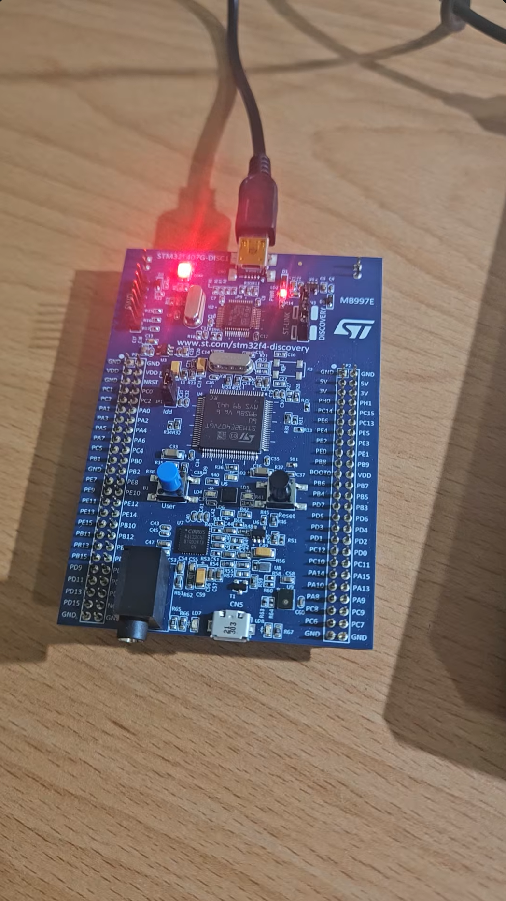

# NVIC Deadlock-like

## Overview

This lab demonstrates a deadlock-like issue caused by using `HAL_Delay()` inside an interrupt callback function.

The experiment uses `PA0 / EXTI0` as the button interrupt input.  
When the button is pressed, STM32 enters `HAL_GPIO_EXTI_Callback()` and turns on the LEDs connected to `PD12`, `PD13`, `PD14`, and `PD15` in sequence.

The main purpose of this lab is to observe the relationship between:

- `HAL_Delay()`
- SysTick interrupt
- NVIC preemption priority
- Interrupt callback function

If SysTick has a lower priority than EXTI0, `HAL_Delay()` may get stuck because the system tick cannot be updated.

## Demo

This demo shows:

- EXTI0 interrupt triggered by the PA0 button
- LED sequence using `HAL_Delay()` inside `HAL_GPIO_EXTI_Callback()`
- Deadlock-like behavior when SysTick priority is too low
- Fixing the issue by increasing SysTick priority

[Watch the demo video](https://youtube.com/shorts/3aw2m1-Z9y4)

<a href="https://youtube.com/shorts/3aw2m1-Z9y4">
  
</a>

## Board / Tool

- STM32F407G-DISC1
- MCU: STM32F407VGT6U
- IDE: Keil uVision (MDK-ARM)
- Tool: STM32CubeMX
- Debugger / Programmer: ST-LINK

## GPIO Pins

| Pin | Function |
|---|---|
| PA0 | EXTI0 button interrupt |
| PD12 | LED |
| PD13 | LED |
| PD14 | LED |
| PD15 | LED |

## Interrupt Priority Setting

### Case 1: Deadlock-like behavior

| Interrupt | Preemption Priority | Sub Priority |
|---|---:|---:|
| SysTick | 15 | 0 |
| EXTI0 | 0 | 0 |

In this case, EXTI0 has a higher priority than SysTick.

Since `HAL_Delay()` depends on SysTick to update the system tick, SysTick must be able to run during the delay.

However, because SysTick has a lower priority than EXTI0, SysTick cannot preempt EXTI0.  
As a result, the tick value cannot increase, and `HAL_Delay()` keeps waiting.

```text
Enter EXTI0 interrupt
↓
Call HAL_Delay()
↓
HAL_Delay() waits for tick update
↓
SysTick is needed to update tick
↓
SysTick priority is lower than EXTI0
↓
SysTick cannot preempt EXTI0
↓
tick does not update
↓
HAL_Delay() gets stuck
```

### Case 2: Fixed behavior

| Interrupt | Preemption Priority | Sub Priority |
|---|---:|---:|
| SysTick | 0 | 0 |
| EXTI0 | 1 | 0 |

In this case, SysTick has a higher priority than EXTI0.

Therefore, SysTick can preempt EXTI0 and update the system tick.  
After the tick value increases normally, `HAL_Delay()` can finish and the LED sequence can continue.

## Main Concepts

- NVIC interrupt priority
- Preemption priority
- SysTick interrupt
- EXTI interrupt
- `HAL_Delay()`
- Deadlock-like behavior in ISR
- Interrupt priority configuration in STM32CubeMX

## Behavior

```text
Case 1:
SysTick priority = 15
EXTI0 priority = 0
→ HAL_Delay() gets stuck inside the EXTI0 callback

Case 2:
SysTick priority = 0
EXTI0 priority = 1
→ SysTick can preempt EXTI0
→ HAL_Delay() works normally
→ LEDs turn on in sequence
```

## Core Logic

```c
void HAL_GPIO_EXTI_Callback(uint16_t GPIO_Pin)
{
    uint8_t i, j;
    uint16_t PIN_NUM = 0;

    if (HAL_GPIO_ReadPin(GPIOA, GPIO_PIN_0) == GPIO_PIN_SET)
    {
        for (j = 0; j < 3; j++)
        {
            for (i = 0; i < 4; i++)
            {
                PIN_NUM = (GPIO_PIN_12 << i);
                HAL_GPIO_WritePin(GPIOD, (uint16_t)PIN_NUM, GPIO_PIN_SET);
                HAL_Delay(500);
            }

            HAL_GPIO_WritePin(GPIOD,
                               GPIO_PIN_12 | GPIO_PIN_13 | GPIO_PIN_14 | GPIO_PIN_15,
                               GPIO_PIN_RESET);
            HAL_Delay(500);
        }
    }
}
```

## Explanation

`HAL_Delay()` depends on the system tick value.

In STM32 HAL, this tick value is usually updated by the SysTick interrupt.

If `HAL_Delay()` is called inside an interrupt callback, but SysTick has a lower priority than that interrupt, SysTick cannot run while the current ISR is executing.

Therefore, the tick value cannot increase, and `HAL_Delay()` cannot finish.

This creates a deadlock-like behavior:

```text
EXTI0 ISR waits for SysTick to update tick
SysTick waits for EXTI0 ISR to finish
```

## Note

This lab intentionally uses `HAL_Delay()` inside `HAL_GPIO_EXTI_Callback()` to demonstrate how NVIC priority affects interrupt behavior.

In real applications, it is usually better to keep ISR code short and avoid long delay operations inside interrupt callbacks.
