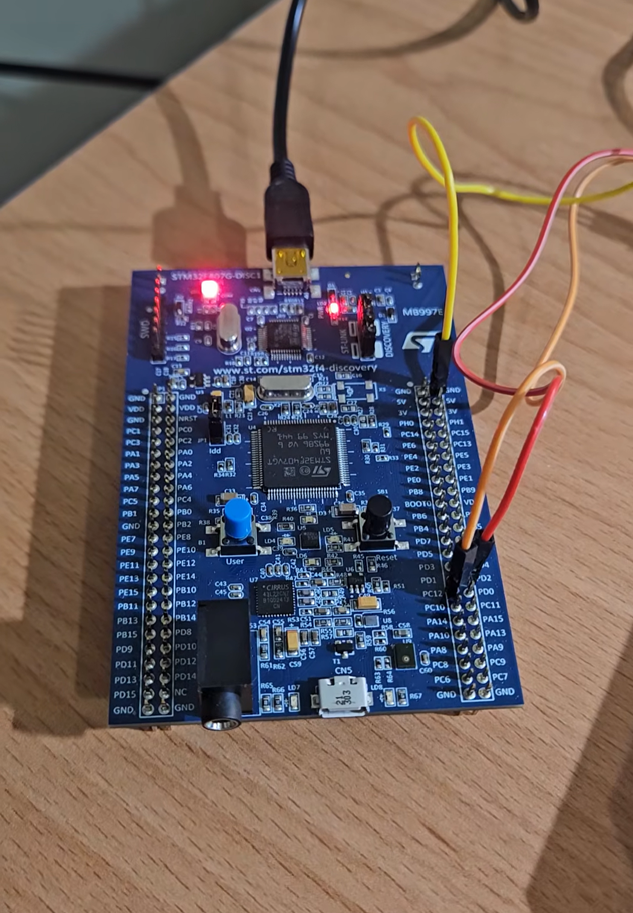

# NVIC Sub Priority

## Overview

This lab demonstrates the behavior of NVIC sub priority when two interrupts have the same preemption priority.

The experiment uses `PA0 / EXTI0` as a button interrupt input and `UART5` as a UART receive interrupt source.

When the PA0 button is pressed, STM32 enters `HAL_GPIO_EXTI_Callback()` and turns on the LEDs connected to `PD12`, `PD13`, `PD14`, and `PD15` in sequence.

While the EXTI0 interrupt is running, sending one byte from the serial terminal triggers the UART5 receive interrupt.

In this lab, EXTI0 and UART5 have the same preemption priority, but UART5 has a higher sub priority.

Even though UART5 has a higher sub priority, it cannot preempt EXTI0 because sub priority does not cause interrupt preemption.

## Demo

This demo shows:

- PA0 button triggering EXTI0 interrupt
- LED sequence running inside `HAL_GPIO_EXTI_Callback()`
- UART5 receive interrupt triggered by sending one byte from serial terminal
- UART5 not preempting EXTI0 because both interrupts have the same preemption priority
- UART5 running after EXTI0 finishes

[Watch the demo video](YOUR_VIDEO_LINK)

<a href="YOUR_VIDEO_LINK">
  
</a>

## Board / Tool

- STM32F407G-DISC1
- MCU: STM32F407VGT6U
- IDE: Keil uVision (MDK-ARM)
- Tool: STM32CubeMX
- Debugger / Programmer: ST-LINK
- UART Tool: USB to UART module / Serial terminal

## GPIO Pins

| Pin | Function |
|---|---|
| PA0 | EXTI0 button interrupt |
| PD12 | LED |
| PD13 | LED |
| PD14 | LED |
| PD15 | LED |

## UART Pins

| Pin | Function |
|---|---|
| PC12 | UART5_TX |
| PD2 | UART5_RX |
| GND | Common ground |

## UART Setting

| Item | Setting |
|---|---|
| UART | UART5 |
| Baud rate | 115200 |
| Word Length | 8 Bits |
| Parity | None |
| Stop Bits | 1 |
| Mode | TX / RX |

This setting is commonly written as:

```text
115200, 8N1
```

## Interrupt Priority Setting

| Interrupt | Preemption Priority | Sub Priority |
|---|---:|---:|
| SysTick | 0 | 0 |
| UART5 | 1 | 0 |
| EXTI0 | 1 | 1 |

In this lab, SysTick is set to the highest priority to prevent `HAL_Delay()` from getting stuck inside interrupt callbacks.

UART5 and EXTI0 have the same preemption priority:

```text
UART5 Preemption Priority = 1
EXTI0 Preemption Priority = 1
```

However, UART5 has a higher sub priority:

```text
UART5 Sub Priority = 0
EXTI0 Sub Priority = 1
```

Since priority numbers are smaller when the priority is higher:

```text
UART5 Sub Priority > EXTI0 Sub Priority
```

However, sub priority does not cause interrupt preemption.

Therefore, UART5 cannot preempt EXTI0 while EXTI0 is already running.

## Main Concepts

- NVIC interrupt priority
- Preemption priority
- Sub priority
- Pending interrupt
- EXTI interrupt
- UART receive interrupt
- `HAL_UART_Receive_IT()`
- `HAL_GPIO_EXTI_Callback()`
- `HAL_UART_RxCpltCallback()`

## Behavior

```text
Press PA0
→ EXTI0 interrupt starts
→ LEDs turn on in sequence

Send one byte from serial terminal while EXTI0 is running
→ UART5 interrupt occurs
→ UART5 cannot preempt EXTI0
→ UART5 becomes pending
→ EXTI0 finishes the LED sequence first
→ UART5 runs after EXTI0 finishes
→ LEDs toggle 4 times
```

## Core Logic

### Start UART interrupt receive

```c
uint8_t uRx_Data;

if (HAL_UART_Receive_IT(&huart5, &uRx_Data, 1) == HAL_OK)
{
    uint8_t Test[] = "HAL_UART_Receive_IT has been called!\r\n";
    HAL_UART_Transmit(&huart5, Test, sizeof(Test), 10);
}
```

`HAL_UART_Receive_IT(&huart5, &uRx_Data, 1)` starts UART5 interrupt reception.

The receive size is set to `1`, so UART5 triggers an interrupt after receiving one byte.

### EXTI0 callback

```c
void HAL_GPIO_EXTI_Callback(uint16_t GPIO_Pin)
{
    uint8_t i, j;
    uint16_t PIN_NUM = 0;

    if (GPIO_Pin == GPIO_PIN_0)
    {
        if (HAL_GPIO_ReadPin(GPIOA, GPIO_PIN_0) == GPIO_PIN_SET)
        {
            for (j = 0; j < 3; j++)
            {
                for (i = 0; i < 4; i++)
                {
                    PIN_NUM = GPIO_PIN_12 << i;

                    HAL_GPIO_WritePin(GPIOD, PIN_NUM, GPIO_PIN_SET);
                    HAL_Delay(500);
                }

                HAL_GPIO_WritePin(GPIOD,
                                   GPIO_PIN_12 | GPIO_PIN_13 | GPIO_PIN_14 | GPIO_PIN_15,
                                   GPIO_PIN_RESET);

                HAL_Delay(500);
            }
        }
    }
}
```

When PA0 is pressed, EXTI0 is triggered.

The LEDs connected to `PD12`, `PD13`, `PD14`, and `PD15` turn on in sequence.  
After one sequence finishes, all LEDs are turned off.  
This sequence runs 3 times.

### UART5 receive complete callback

```c
void HAL_UART_RxCpltCallback(UART_HandleTypeDef *huart)
{
    uint8_t i;

    if (huart->Instance == UART5)
    {
        for (i = 0; i < 4; i++)
        {
            HAL_GPIO_TogglePin(GPIOD,
                               GPIO_PIN_12 | GPIO_PIN_13 | GPIO_PIN_14 | GPIO_PIN_15);

            HAL_Delay(1000);
        }

        HAL_UART_Receive_IT(&huart5, &uRx_Data, 1);
    }
}
```

When UART5 receives one byte, `HAL_UART_RxCpltCallback()` is called.

Inside the callback, the LEDs are toggled 4 times.

After the UART interrupt finishes, `HAL_UART_Receive_IT()` is called again to restart UART interrupt reception.

This is necessary because `HAL_UART_Receive_IT()` only receives the specified number of bytes once.  
After one byte is received, the receive task is complete and must be restarted if the program needs to receive more data.

## Explanation

The main purpose of this lab is to observe that sub priority does not cause interrupt preemption.

EXTI0 starts first when the PA0 button is pressed.

While EXTI0 is still running, one byte is sent from the serial terminal to trigger UART5 interrupt.

Although UART5 has a higher sub priority than EXTI0, both interrupts have the same preemption priority.

Because of this, UART5 cannot preempt EXTI0.

Instead, UART5 becomes pending and waits until EXTI0 finishes.

```text
EXTI0 is running
↓
UART5 interrupt occurs
↓
UART5 and EXTI0 have the same preemption priority
↓
UART5 cannot preempt EXTI0
↓
UART5 becomes pending
↓
EXTI0 continues running
↓
EXTI0 finishes
↓
UART5 callback runs
```

## Note

This lab intentionally uses `HAL_Delay()` inside interrupt callbacks to make the interrupt execution time longer and easier to observe.

In real applications, interrupt callback functions should usually be kept short.

The key point of this lab is:

```text
Preemption Priority controls interrupt preemption.

Sub Priority only affects the order of pending interrupts.

Sub Priority does not preempt a currently running interrupt.
```
