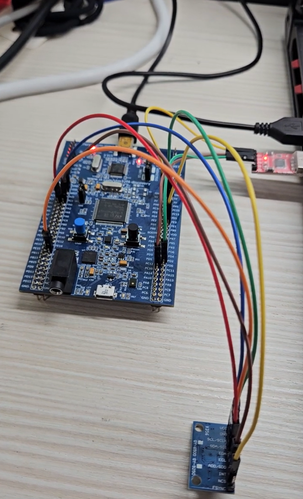

# SPI Interrupt

## Overview

This lab demonstrates how to use STM32 SPI in interrupt mode to read accelerometer data from an MPU6500 sensor.

The experiment uses `SPI2` as the communication interface between STM32 and MPU6500.
In this lab, STM32 works as the SPI Master, and MPU6500 works as the SPI Slave.

At the beginning of the program, polling mode is still used to check and initialize the MPU6500.

The program first reads the `WHO_AM_I` register to check whether SPI communication is successful.
Then it writes `0x00` to the `PWR_MGMT_1` register to wake up the MPU6500.
After that, the 3-axis accelerometer data is read using SPI interrupt mode.

When SPI transmission and reception are complete, the SPI interrupt is triggered.
Then STM32 enters `HAL_SPI_TxRxCpltCallback()` to process the received accelerometer data.

The converted acceleration values are transmitted to the computer through UART5, so the values can be observed in a serial terminal.

In this lab, the 3-axis accelerometer reading uses SPI interrupt mode.
UART5 is still used in polling mode with `HAL_UART_Transmit()` because it is only used to print the result for observation.

The main purpose of this lab is to understand the relationship between:

* SPI communication
* SPI interrupt
* SPI callback function
* CS / NCS control
* Full-duplex transmit and receive
* MPU6500 register access
* Accelerometer data conversion
* UART output

In this experiment, the accelerometer data is read from MPU6500 and converted into `g` values.

## Demo

This demo shows:

* Reading `WHO_AM_I` from MPU6500 through SPI
* Writing `PWR_MGMT_1 = 0x00` to wake up MPU6500
* Reading 3-axis accelerometer data using SPI interrupt mode
* Entering `HAL_SPI_TxRxCpltCallback()` after SPI transmission and reception are complete
* Converting raw accelerometer data into `g`
* Sending acceleration values to the computer through UART5

[Watch the demo video](https://youtu.be/7uOFTGUvc-0)

<a href="https://youtu.be/7uOFTGUvc-0">
  
</a>

## Board / Tool

* STM32F407G-DISC1
* MCU: STM32F407VGT6U
* IDE: Keil uVision (MDK-ARM)
* Tool: STM32CubeMX
* Debugger / Programmer: ST-LINK

## SPI Pins

| STM32 Pin | Function  | MPU6500 Pin |
| --------- | --------- | ----------- |
| PB10      | SPI2_SCK  | SCLK        |
| PC3       | SPI2_MOSI | SDI         |
| PC2       | SPI2_MISO | SDO         |
| PE3       | GPIO      | NCS         |

`PE3` is used as a GPIO output to manually control the MPU6500 chip select pin.

The MPU6500 `NCS` pin is active low:

```text
NCS = Low  -> MPU6500 is selected
NCS = High -> MPU6500 is not selected
```

## UART Pins

| Pin  | Function |
| ---- | -------- |
| PC12 | UART5_TX |
| PD2  | UART5_RX |

UART5 is used to send the MPU6500 data to the computer.

The UART setting is:

```text
115200, 8N1
```

## SPI Setting

| Item                | Setting             |
| ------------------- | ------------------- |
| SPI                 | SPI2                |
| Mode                | Master              |
| Direction           | 2 Lines Full-Duplex |
| Data Size           | 8 Bits              |
| First Bit           | MSB First           |
| Clock Polarity      | High                |
| Clock Phase         | 2 Edge              |
| NSS                 | Software            |
| Baud Rate Prescaler | 2                   |

In this lab, the SPI clock setting is:

```text
Clock Polarity = High
Clock Phase    = 2 Edge
```

This means the SPI mode is:

```text
SPI Mode 3
CPOL = 1
CPHA = 1
```

For SPI Mode 3:

```text
SCLK idle = High
Data is sampled on the rising edge
Data changes on the falling edge
```

This matches the MPU6500 SPI timing requirement.

## Interrupt Setting

For SPI interrupt mode, the SPI2 global interrupt must be enabled in STM32CubeMX.

| Interrupt             | Setting |
| --------------------- | ------- |
| SPI2 global interrupt | Enabled |

The interrupt handler should call `HAL_SPI_IRQHandler()`:

```c
void SPI2_IRQHandler(void)
{
    HAL_SPI_IRQHandler(&hspi2);
}
```

If the SPI2 interrupt is not enabled, `HAL_SPI_TxRxCpltCallback()` will not be executed after SPI transmission is complete.

## MPU6500 Registers

| Register     | Address | Description                         |
| ------------ | ------- | ----------------------------------- |
| WHO_AM_I     | 0x75    | Used to check MPU6500 identity      |
| PWR_MGMT_1   | 0x6B    | Power management register           |
| ACCEL_XOUT_H | 0x3B    | Start address of accelerometer data |

The expected value of `WHO_AM_I` is:

```text
0x70
```

If the value read from `WHO_AM_I` is `0x70`, it means that STM32 can communicate with MPU6500 correctly.

## Main Concepts

* SPI is a synchronous communication protocol
* STM32 works as SPI Master
* MPU6500 works as SPI Slave
* SPI uses CS / NCS to select the Slave device
* SPI interrupt means the callback function is executed after SPI transfer is complete
* `HAL_SPI_TransmitReceive_IT()` starts SPI transmit and receive in interrupt mode
* `HAL_SPI_TxRxCpltCallback()` is called when SPI transmit and receive are complete
* SPI read uses `Read bit + Register Address`
* SPI read also needs dummy bytes to generate clock
* UART5 is used to print the result to the computer
* UART5 transmit is still polling in this lab

## Behavior

```text
STM32 starts program
↓
Set MPU6500 CS High
↓
Read WHO_AM_I register using polling
↓
If WHO_AM_I = 0x70
↓
MPU6500 communication is successful
↓
Write PWR_MGMT_1 = 0x00 using polling
↓
MPU6500 wakes up
↓
Start SPI interrupt read for accelerometer data
↓
SPI transmission and reception complete
↓
SPI interrupt is triggered
↓
HAL_SPI_TxRxCpltCallback() is executed
↓
Accelerometer data is copied from RX buffer
↓
Main loop converts raw data into g
↓
UART5 sends AX / AY / AZ values to the computer
↓
Start next SPI interrupt read
```

## SPI Interrupt Read Method

To read 3-axis accelerometer data, the program reads 6 bytes from `ACCEL_XOUT_H`.

The accelerometer data contains:

```text
ACCEL_XOUT_H
ACCEL_XOUT_L
ACCEL_YOUT_H
ACCEL_YOUT_L
ACCEL_ZOUT_H
ACCEL_ZOUT_L
```

Each axis has a high byte and a low byte.

For SPI read, the Master must first send:

```text
Read bit + Register Address
```

Then the Master sends dummy bytes to generate clock, so the MPU6500 can return data through MISO / SDO.

Therefore, the SPI interrupt transfer length is 7 bytes:

```text
1 byte address + 6 bytes accelerometer data = 7 bytes
```

The transmit and receive buffer relationship is:

```text
tx[0] = Read bit + ACCEL_XOUT_H    rx[0] = not used
tx[1] = dummy byte                 rx[1] = ACCEL_XOUT_H
tx[2] = dummy byte                 rx[2] = ACCEL_XOUT_L
tx[3] = dummy byte                 rx[3] = ACCEL_YOUT_H
tx[4] = dummy byte                 rx[4] = ACCEL_YOUT_L
tx[5] = dummy byte                 rx[5] = ACCEL_ZOUT_H
tx[6] = dummy byte                 rx[6] = ACCEL_ZOUT_L
```

The first received byte `rx[0]` is not used because it is received while the Master is sending the register address.

The actual accelerometer data is stored in:

```text
rx[1] ~ rx[6]
```

## Core Logic

```c
#define WHO_AM_I_MPU6500    0x75
#define PWR_MGMT_1          0x6B
#define ACCEL_XOUT_H        0x3B

#define MPU6500_CS_PORT     GPIOE
#define MPU6500_CS_PIN      GPIO_PIN_3

#define ACCEL_DATA_LEN      6
#define ACCEL_SPI_LEN       7
```

SPI interrupt buffers and flags:

```c
static uint8_t accelTx_IT[ACCEL_SPI_LEN];
static uint8_t accelRx_IT[ACCEL_SPI_LEN];
static uint8_t accelData[ACCEL_DATA_LEN];

static volatile uint8_t accelBusy = 0;
static volatile uint8_t accelReady = 0;
```

CS control:

```c
static void MPU6500_CS_LOW(void)
{
    HAL_GPIO_WritePin(MPU6500_CS_PORT, MPU6500_CS_PIN, GPIO_PIN_RESET);
}

static void MPU6500_CS_HIGH(void)
{
    HAL_GPIO_WritePin(MPU6500_CS_PORT, MPU6500_CS_PIN, GPIO_PIN_SET);
}
```

Start SPI interrupt read:

```c
static HAL_StatusTypeDef MPU6500_ReadAccel_IT(void)
{
    HAL_StatusTypeDef ret;

    if (accelBusy)
    {
        return HAL_BUSY;
    }

    accelTx_IT[0] = ACCEL_XOUT_H | 0x80;

    for (uint8_t i = 1; i < ACCEL_SPI_LEN; i++)
    {
        accelTx_IT[i] = 0x00;
    }

    accelBusy = 1;
    accelReady = 0;

    MPU6500_CS_LOW();

    ret = HAL_SPI_TransmitReceive_IT(&hspi2,
                                      accelTx_IT,
                                      accelRx_IT,
                                      ACCEL_SPI_LEN);

    if (ret != HAL_OK)
    {
        MPU6500_CS_HIGH();
        accelBusy = 0;
    }

    return ret;
}
```

SPI transmit and receive complete callback:

```c
void HAL_SPI_TxRxCpltCallback(SPI_HandleTypeDef *hspi)
{
    if (hspi->Instance == SPI2)
    {
        MPU6500_CS_HIGH();

        accelData[0] = accelRx_IT[1];
        accelData[1] = accelRx_IT[2];
        accelData[2] = accelRx_IT[3];
        accelData[3] = accelRx_IT[4];
        accelData[4] = accelRx_IT[5];
        accelData[5] = accelRx_IT[6];

        accelBusy = 0;
        accelReady = 1;
    }
}
```

SPI error callback:

```c
void HAL_SPI_ErrorCallback(SPI_HandleTypeDef *hspi)
{
    if (hspi->Instance == SPI2)
    {
        MPU6500_CS_HIGH();

        accelBusy = 0;
        accelReady = 0;
    }
}
```

## Explanation

`MPU6500_ReadAccel_IT()` is used to start SPI interrupt reading for accelerometer data.

Before starting a new SPI interrupt transfer, the program checks:

```c
if (accelBusy)
{
    return HAL_BUSY;
}
```

This prevents starting a new SPI transfer before the previous one is complete.

The first transmitted byte is:

```text
ACCEL_XOUT_H | 0x80
```

This sets bit7 to `1`, which means SPI read.

The remaining 6 transmitted bytes are dummy bytes:

```text
0x00
```

These dummy bytes are used to generate SPI clock, so the MPU6500 can return accelerometer data.

Before starting SPI communication, CS is pulled low:

```c
MPU6500_CS_LOW();
```

Then SPI transmit and receive interrupt mode is started:

```c
HAL_SPI_TransmitReceive_IT(&hspi2,
                           accelTx_IT,
                           accelRx_IT,
                           ACCEL_SPI_LEN);
```

After the SPI transfer is complete, STM32 enters:

```c
HAL_SPI_TxRxCpltCallback()
```

Inside the callback function, CS is pulled high:

```c
MPU6500_CS_HIGH();
```

This ends the SPI transaction.

Then the received accelerometer data is copied from `accelRx_IT[1] ~ accelRx_IT[6]` to `accelData[0] ~ accelData[5]`.

Finally:

```c
accelBusy = 0;
accelReady = 1;
```

is used to tell the main loop that the accelerometer data is ready to be processed.

In this lab, UART5 transmit is still polling-based.
The main purpose of UART5 is only to print the accelerometer data for observation, so UART interrupt is not used here.

## Accelerometer Data Conversion

In the main loop, when `accelReady` becomes `1`, the program combines the high byte and low byte into 16-bit signed data.

```c
accelX = (int16_t)((accelData[0] << 8) | accelData[1]);
accelY = (int16_t)((accelData[2] << 8) | accelData[3]);
accelZ = (int16_t)((accelData[4] << 8) | accelData[5]);
```

The MPU6500 default accelerometer range is `±2g`.

For `±2g`, the sensitivity is:

```text
16384 LSB/g
```

Therefore, the raw values are converted into `g` by:

```c
accelX_g = accelX / 16384.0f;
accelY_g = accelY / 16384.0f;
accelZ_g = accelZ / 16384.0f;
```

The output format is:

```c
snprintf(msg, sizeof(msg),
         "AX = %.3f g, AY = %.3f g, AZ = %.3f g\r\n",
         accelX_g, accelY_g, accelZ_g);
```

`%.3f` means the floating-point value is printed with 3 digits after the decimal point.

Example output:

```text
AX = -0.037 g, AY = -0.302 g, AZ = -0.894 g
```

## Interrupt Flow

```text
Program starts
↓
Initialize GPIO, SPI2, UART5
↓
Set MPU6500 CS High
↓
Read WHO_AM_I using polling
↓
Write PWR_MGMT_1 = 0x00 using polling
↓
Start MPU6500_ReadAccel_IT()
↓
CS Low
↓
HAL_SPI_TransmitReceive_IT()
↓
Main program continues running
↓
SPI transfer complete
↓
SPI interrupt is triggered
↓
Enter HAL_SPI_TxRxCpltCallback()
↓
CS High
↓
Copy rx[1] ~ rx[6] to accelData[]
↓
Set accelReady = 1
↓
Main loop processes accelerometer data
↓
Convert raw data into g
↓
Print AX / AY / AZ through UART5
↓
Start next SPI interrupt read
↓
Repeat
```

## Why Use 7 Bytes

The MPU6500 accelerometer data needs 6 bytes:

```text
XH, XL, YH, YL, ZH, ZL
```

However, SPI read requires the Master to first send the register address with the read bit.

Therefore, the total SPI transfer length is:

```text
1 byte read command + 6 bytes data = 7 bytes
```

The first received byte is not used because it is received while sending the register address.

```text
rx[0] = not used
rx[1] ~ rx[6] = accelerometer data
```

## Why Use accelBusy and accelReady

`accelBusy` is used to prevent starting a new SPI interrupt transfer before the previous transfer is complete.

```text
accelBusy = 1
↓
SPI transfer is running
```

When SPI transfer is complete, the callback clears it:

```text
accelBusy = 0
```

`accelReady` is used to notify the main loop that new accelerometer data is ready.

```text
accelReady = 1
↓
Main loop can process accelerometer data
```

Because these variables are shared between the main loop and interrupt callback, they are declared as `volatile`.

## SPI Polling vs SPI Interrupt

| Item                  | SPI Polling                                     | SPI Interrupt                                   |
| --------------------- | ----------------------------------------------- | ----------------------------------------------- |
| Start function        | `HAL_SPI_TransmitReceive()`                     | `HAL_SPI_TransmitReceive_IT()`                  |
| Waiting method        | Main program waits for SPI transfer to complete | SPI interrupt triggers after transfer complete  |
| Data processing       | After function returns                          | After `HAL_SPI_TxRxCpltCallback()`              |
| Main program behavior | Blocks during SPI transfer                      | Can continue running after transfer starts      |
| Completion handling   | Return value                                    | Callback function                               |
| CS control            | CS High after polling function returns          | CS High inside callback after transfer complete |

Simple comparison:

```text
SPI Polling:
CS Low → TransmitReceive → Wait complete → CS High → Process data

SPI Interrupt:
CS Low → TransmitReceive_IT → Main continues
       → Callback after complete → CS High → Process data
```

## Note

This lab uses SPI interrupt mode for reading accelerometer data from MPU6500.

The initial register check and wake-up process still use polling mode because they are only executed once during initialization.

UART5 is only used to print accelerometer values, so UART transmission still uses polling mode with `HAL_UART_Transmit()`.

This is acceptable for a basic SPI interrupt experiment.

In real applications, it is usually better to keep interrupt callback functions short and avoid doing long blocking operations inside callbacks.
