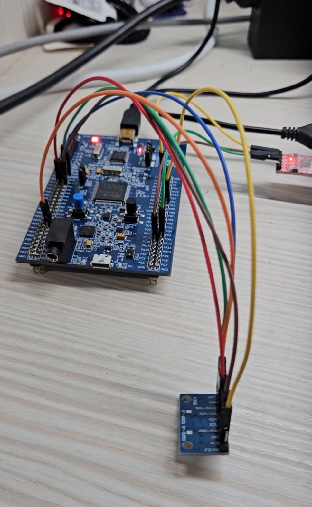

# SPI Polling

## Overview

This lab demonstrates how to use STM32 SPI in polling mode to communicate with an MPU6500 sensor.

The experiment uses `SPI2` as the communication interface between STM32 and MPU6500.
In this lab, STM32 works as the SPI Master, and MPU6500 works as the SPI Slave.

The program first reads the `WHO_AM_I` register to check whether SPI communication is successful.
Then it writes `0x00` to the `PWR_MGMT_1` register to wake up the MPU6500.
After that, the program continuously reads the 3-axis accelerometer data and converts the raw values into `g`.

The converted acceleration values are transmitted to the computer through UART5, so the values can be observed in a serial terminal.

The main purpose of this lab is to understand the relationship between:

* SPI communication
* Master and Slave
* CS / NCS control
* SPI read operation
* SPI write operation
* Polling method
* MPU6500 register access
* UART output

In this experiment, the accelerometer data is read from MPU6500 and converted into `g` values.

## Demo

This demo shows:

* Reading `WHO_AM_I` from MPU6500 through SPI
* Writing `PWR_MGMT_1 = 0x00` to wake up MPU6500
* Reading 3-axis accelerometer data using SPI polling mode
* Converting raw accelerometer data into `g`
* Sending acceleration values to the computer through UART5

[Watch the demo video](https://youtube.com/your-demo-link)

<a href="https://youtube.com/your-demo-link">
  
</a>

## Board / Tool

* STM32F407G-DISC1
* MCU: STM32F407VGT6U
* IDE: Keil uVision (MDK-ARM)
* Tool: STM32CubeMX
* Debugger / Programmer: ST-LINK

## SPI Pins

| STM32 Pin | Function  | MPU6500 Pin |
| --------- | --------- | ----------- |
| PB10      | SPI2_SCK  | SCLK        |
| PC3       | SPI2_MOSI | SDI         |
| PC2       | SPI2_MISO | SDO         |
| PE3       | GPIO      | NCS         |

`PE3` is used as a GPIO output to manually control the MPU6500 chip select pin.

The MPU6500 `NCS` pin is active low:

```text
NCS = Low  -> MPU6500 is selected
NCS = High -> MPU6500 is not selected
```

## UART Pins

| Pin  | Function |
| ---- | -------- |
| PC12 | UART5_TX |
| PD2  | UART5_RX |

UART5 is used to send the MPU6500 data to the computer.

The UART setting is:

```text
115200, 8N1
```

## SPI Setting

| Item                | Setting             |
| ------------------- | ------------------- |
| SPI                 | SPI2                |
| Mode                | Master              |
| Direction           | 2 Lines Full-Duplex |
| Data Size           | 8 Bits              |
| First Bit           | MSB First           |
| Clock Polarity      | High                |
| Clock Phase         | 2 Edge              |
| NSS                 | Software            |
| Baud Rate Prescaler | 2                   |

In this lab, the SPI clock setting is:

```text
Clock Polarity = High
Clock Phase    = 2 Edge
```

This means the SPI mode is:

```text
SPI Mode 3
CPOL = 1
CPHA = 1
```

For SPI Mode 3:

```text
SCLK idle = High
Data is sampled on the rising edge
Data changes on the falling edge
```

This matches the MPU6500 SPI timing requirement.

## MPU6500 Registers

| Register     | Address | Description                         |
| ------------ | ------- | ----------------------------------- |
| WHO_AM_I     | 0x75    | Used to check MPU6500 identity      |
| PWR_MGMT_1   | 0x6B    | Power management register           |
| ACCEL_XOUT_H | 0x3B    | Start address of accelerometer data |

The expected value of `WHO_AM_I` is:

```text
0x70
```

If the value read from `WHO_AM_I` is `0x70`, it means that STM32 can communicate with MPU6500 correctly.

## Main Concepts

* SPI is a synchronous communication protocol
* STM32 works as SPI Master
* MPU6500 works as SPI Slave
* SPI uses CS / NCS to select the Slave device
* SPI does not use Slave Address like I2C
* SPI still needs Register Address to access internal registers
* SPI read operation uses `Read bit + Register Address`
* SPI write operation uses `Write bit + Register Address`
* SPI polling means the main program waits for SPI transmission to complete
* UART5 is used to print the result to the computer

## Behavior

```text
STM32 starts program
↓
Set MPU6500 CS High
↓
Read WHO_AM_I register
↓
If WHO_AM_I = 0x70
↓
MPU6500 communication is successful
↓
Write PWR_MGMT_1 = 0x00
↓
MPU6500 wakes up
↓
Read accelerometer data from ACCEL_XOUT_H
↓
Convert raw data into g
↓
Send AX / AY / AZ values through UART5
```

## SPI Read Operation

For MPU6500 SPI read, the first byte contains:

```text
bit7 = 1
bit6 ~ bit0 = Register Address
```

Therefore, the register address needs to be OR with `0x80`.

For example, to read `WHO_AM_I`:

```text
WHO_AM_I = 0x75
Read bit = 1

0x75 | 0x80 = 0xF5
```

The first byte sent by the Master is:

```text
0xF5
```

This means:

```text
Read register 0x75
```

After sending the register address, the Master sends a dummy byte to generate clock.
Then the MPU6500 returns the register value through MISO / SDO.

## SPI Write Operation

For MPU6500 SPI write, the first byte contains:

```text
bit7 = 0
bit6 ~ bit0 = Register Address
```

Therefore, the register address needs to be AND with `0x7F`.

For example, to write `PWR_MGMT_1`:

```text
PWR_MGMT_1 = 0x6B
Write bit = 0

0x6B & 0x7F = 0x6B
```

Then the second byte is the data to be written.

For example:

```text
Register Address = 0x6B
Data             = 0x00
```

This means:

```text
Write 0x00 to PWR_MGMT_1
```

## Core Logic

```c
#define WHO_AM_I_MPU6500    0x75
#define PWR_MGMT_1          0x6B
#define ACCEL_XOUT_H        0x3B

#define MPU6500_CS_PORT     GPIOE
#define MPU6500_CS_PIN      GPIO_PIN_3
```

CS control:

```c
static void MPU6500_CS_LOW(void)
{
    HAL_GPIO_WritePin(MPU6500_CS_PORT, MPU6500_CS_PIN, GPIO_PIN_RESET);
}

static void MPU6500_CS_HIGH(void)
{
    HAL_GPIO_WritePin(MPU6500_CS_PORT, MPU6500_CS_PIN, GPIO_PIN_SET);
}
```

SPI read one register:

```c
static HAL_StatusTypeDef MPU6500_ReadReg(uint8_t reg, uint8_t *data)
{
    HAL_StatusTypeDef ret;
    uint8_t tx[2];
    uint8_t rx[2];

    tx[0] = reg | 0x80;
    tx[1] = 0x00;

    MPU6500_CS_LOW();
    ret = HAL_SPI_TransmitReceive(&hspi2, tx, rx, 2, 100);
    MPU6500_CS_HIGH();

    *data = rx[1];

    return ret;
}
```

SPI write one register:

```c
static HAL_StatusTypeDef MPU6500_WriteReg(uint8_t reg, uint8_t data)
{
    HAL_StatusTypeDef ret;
    uint8_t tx[2];

    tx[0] = reg & 0x7F;
    tx[1] = data;

    MPU6500_CS_LOW();
    ret = HAL_SPI_Transmit(&hspi2, tx, 2, 100);
    MPU6500_CS_HIGH();

    return ret;
}
```

SPI read multiple bytes:

```c
static HAL_StatusTypeDef MPU6500_ReadBytes(uint8_t reg, uint8_t *data, uint16_t len)
{
    HAL_StatusTypeDef ret;
    uint8_t addr;

    addr = reg | 0x80;

    MPU6500_CS_LOW();

    ret = HAL_SPI_Transmit(&hspi2, &addr, 1, 100);
    if (ret == HAL_OK)
    {
        ret = HAL_SPI_Receive(&hspi2, data, len, 100);
    }

    MPU6500_CS_HIGH();

    return ret;
}
```

## Explanation

`MPU6500_ReadReg()` is used to read one register from MPU6500.

The first transmitted byte is:

```text
Register Address | 0x80
```

This sets bit7 to `1`, which means SPI read.

The second transmitted byte is a dummy byte:

```text
0x00
```

The dummy byte is used to generate SPI clock.
This is necessary because SPI clock is always generated by the Master.

During `HAL_SPI_TransmitReceive()`:

```text
tx[0] is sent, rx[0] is received
tx[1] is sent, rx[1] is received
```

The actual register data is stored in:

```c
rx[1]
```

Therefore:

```c
*data = rx[1];
```

is used to store the received value into the variable passed by pointer.

`MPU6500_WriteReg()` is used to write one register.

The first transmitted byte is:

```text
Register Address & 0x7F
```

This clears bit7 to `0`, which means SPI write.

The second transmitted byte is the data to be written into the register.

`MPU6500_ReadBytes()` is used to read multiple continuous bytes.
This is used to read accelerometer data from MPU6500.

For accelerometer data, the program reads 6 bytes from `ACCEL_XOUT_H`:

```text
ACCEL_XOUT_H
ACCEL_XOUT_L
ACCEL_YOUT_H
ACCEL_YOUT_L
ACCEL_ZOUT_H
ACCEL_ZOUT_L
```

Each axis has a high byte and a low byte.

## Accelerometer Data Conversion

The accelerometer raw data is combined as 16-bit signed data.

```c
accelX = (int16_t)((accelData[0] << 8) | accelData[1]);
accelY = (int16_t)((accelData[2] << 8) | accelData[3]);
accelZ = (int16_t)((accelData[4] << 8) | accelData[5]);
```

The MPU6500 default accelerometer range is `±2g`.

For `±2g`, the sensitivity is:

```text
16384 LSB/g
```

Therefore, the raw values are converted into `g` by:

```c
accelX_g = accelX / 16384.0f;
accelY_g = accelY / 16384.0f;
accelZ_g = accelZ / 16384.0f;
```

The output format is:

```c
snprintf(msg, sizeof(msg),
         "AX = %.3f g, AY = %.3f g, AZ = %.3f g\r\n",
         accelX_g, accelY_g, accelZ_g);
```

`%.3f` means the floating-point value is printed with 3 digits after the decimal point.

Example output:

```text
AX = 0.012 g, AY = -0.035 g, AZ = 0.998 g
```

## Polling Flow

```text
Initialize GPIO, SPI2, and UART5
↓
Set MPU6500 CS High
↓
Read WHO_AM_I register
↓
Check whether WHO_AM_I is 0x70
↓
Write PWR_MGMT_1 = 0x00
↓
Read back PWR_MGMT_1
↓
Start reading accelerometer data
↓
Read 6 bytes from ACCEL_XOUT_H
↓
Combine high byte and low byte
↓
Convert raw data into g
↓
Print AX / AY / AZ through UART5
↓
Delay 500 ms
↓
Repeat
```

## Note

This lab uses SPI polling mode, so the main program waits for SPI transmission or reception to complete before continuing.

This method is simple and easy to understand, so it is suitable for learning basic SPI communication.

In this lab, CS / NCS is controlled manually by GPIO because SPI NSS is configured as Software.

For more advanced applications, SPI interrupt mode or DMA mode can be used to reduce CPU waiting time and improve efficiency.
