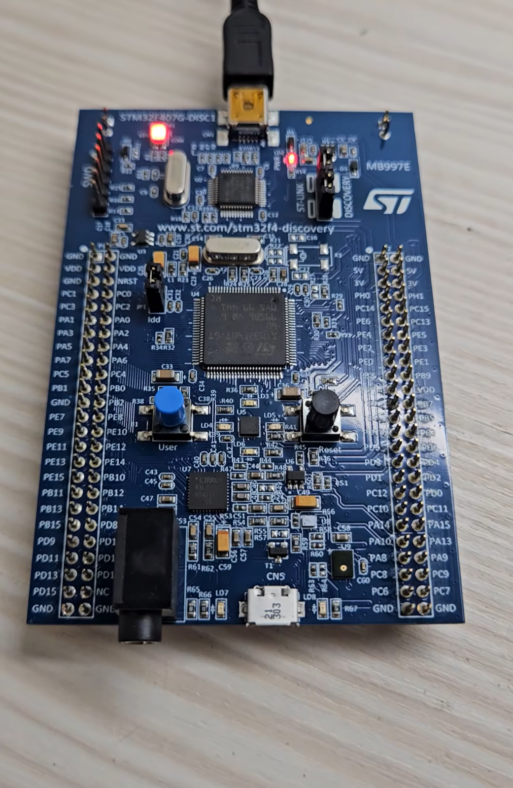

# Timer Interrupt

## Overview

This lab uses `TIM7` basic timer interrupt to trigger an event every 1 second.

The experiment uses `TIM7` to generate a periodic update interrupt.  
When the timer interrupt occurs, STM32 enters `HAL_TIM_PeriodElapsedCallback()` and toggles the LEDs connected to `PD12`, `PD13`, `PD14`, and `PD15`.

The main purpose of this lab is to observe the relationship between:

- Basic Timer
- Timer clock
- Prescaler (PSC)
- Auto-reload register (ARR)
- Update event
- Timer interrupt callback function

In this lab, the external high-speed clock `HSE = 8 MHz` is used as the system clock source.

## Demo

This demo shows:

- TIM7 generates an interrupt every 1 second
- `HAL_TIM_PeriodElapsedCallback()` is called periodically
- LEDs toggle in groups every second
- Timer interrupt does not need to be restarted inside the callback

[Watch the demo video](https://youtube.com/shorts/XvCi4jCaCyw)

<a href="https://youtube.com/shorts/XvCi4jCaCyw">
  
</a>

## Board / Tool

- STM32F407G-DISC1
- MCU: STM32F407VGT6U
- IDE: Keil uVision (MDK-ARM)
- Tool: STM32CubeMX
- Debugger / Programmer: ST-LINK

## GPIO Pins

| Pin | Function |
|---|---|
| PD12 | LED |
| PD13 | LED |
| PD14 | LED |
| PD15 | LED |

## Timer Setting

This lab uses `TIM7`.

| Setting | Value |
|---|---:|
| Timer | TIM7 |
| Clock source | HSE |
| Timer clock | 8 MHz |
| Prescaler (PSC) | 7999 |
| Counter Period (ARR) | 999 |
| Counter Mode | Up |
| Auto-reload preload | Enable |
| TIM7 global interrupt | Enable |

## Timer Period Calculation

The timer clock is configured as:

```text
TIM7 clock = 8 MHz = 8,000,000 Hz
```

First, the prescaler divides the timer clock:

```text
CK_CNT = Timer clock / (PSC + 1)

CK_CNT = 8,000,000 / (7999 + 1)
       = 8,000,000 / 8000
       = 1000 Hz
```

After the prescaler, the counter clock becomes `1000 Hz`.

This means the counter increases once every 1 ms:

```text
1 / 1000 Hz = 0.001 s = 1 ms
```

Next, the auto-reload register is set to:

```text
ARR = 999
```

So the counter counts from `0` to `999`, which is 1000 counts in total:

```text
0 → 1 → 2 → ... → 999
```

Since each count takes 1 ms:

```text
1000 counts × 1 ms = 1000 ms = 1 second
```

Therefore, TIM7 generates an update event every 1 second.

```text
8,000,000 Hz
↓ PSC = 7999, divide by 8000
1,000 Hz
↓ ARR = 999, count 1000 times
1 Hz
```

## Behavior

Assuming all LEDs are initially OFF:

```text
Initial state:
PD12 / PD13 / PD14 / PD15 OFF

After 1 second:
PD12 / PD14 ON

After 2 seconds:
PD12 / PD13 / PD14 / PD15 ON

After 3 seconds:
PD12 / PD14 OFF
PD13 / PD15 ON

After 4 seconds:
PD12 / PD13 / PD14 / PD15 OFF
```

Then the same pattern repeats.

## Core Logic

TIM7 interrupt is started once in `USER CODE BEGIN 2`:

```c
/* USER CODE BEGIN 2 */
HAL_TIM_Base_Start_IT(&htim7);
/* USER CODE END 2 */
```

When TIM7 reaches the configured period, it triggers an update interrupt and enters `HAL_TIM_PeriodElapsedCallback()`.

```c
/* USER CODE BEGIN 4 */
volatile uint8_t flag = 0;

void HAL_TIM_PeriodElapsedCallback(TIM_HandleTypeDef *htim)
{
    if(htim == &htim7)
    {
        if(flag == 0)
        {
            HAL_GPIO_TogglePin(GPIOD, GPIO_PIN_12);
            HAL_GPIO_TogglePin(GPIOD, GPIO_PIN_14);
            flag++;
        }
        else
        {
            HAL_GPIO_TogglePin(GPIOD, GPIO_PIN_13);
            HAL_GPIO_TogglePin(GPIOD, GPIO_PIN_15);
            flag = 0;
        }
    }
}
/* USER CODE END 4 */
```

## Explanation

`HAL_TIM_Base_Start_IT(&htim7)` starts TIM7 in interrupt mode.

After this function is called, TIM7 starts counting based on the configured prescaler and auto-reload value.

```text
TIM7 starts counting
↓
CNT counts from 0 to ARR
↓
Update event occurs
↓
TIM7 interrupt is triggered
↓
HAL_TIM_PeriodElapsedCallback() is called
```

In this lab, TIM7 generates an update event every 1 second.  
Therefore, the LED state changes once every second.

The condition below is used to check whether the interrupt source is TIM7:

```c
if(htim == &htim7)
```

This is useful because multiple timers can share the same callback function.

## Timer Interrupt vs UART Interrupt

Timer interrupt and UART receive interrupt behave differently.

Timer interrupt is periodic.  
After calling `HAL_TIM_Base_Start_IT()` once, the timer continues running and repeatedly generates interrupts.

```text
HAL_TIM_Base_Start_IT(&htim7)
↓
TIM7 keeps counting
↓
Update event occurs every 1 second
↓
Callback is called repeatedly
```

UART receive interrupt is different.  
`HAL_UART_Receive_IT()` only starts one receive task.  
After the specified number of bytes is received, the receive task is finished and must be started again.

| Item | Timer Interrupt | UART Receive Interrupt |
|---|---|---|
| Start function | `HAL_TIM_Base_Start_IT()` | `HAL_UART_Receive_IT()` |
| Behavior | Periodic event | One-time receive task |
| Restart needed in callback | No | Yes |
| Reason | Timer keeps overflowing | UART receive task ends after receiving data |

## Main Concepts

- Basic Timer
- TIM7
- Timer clock
- HSE clock source
- Prescaler (PSC)
- Auto-reload register (ARR)
- Update event
- Timer interrupt
- `HAL_TIM_Base_Start_IT()`
- `HAL_TIM_PeriodElapsedCallback()`

## Note

Unlike UART receive interrupt, TIM7 interrupt does not need to be restarted inside the callback.

Once `HAL_TIM_Base_Start_IT(&htim7)` is called, TIM7 continues to run and periodically triggers interrupts until the timer is stopped.
