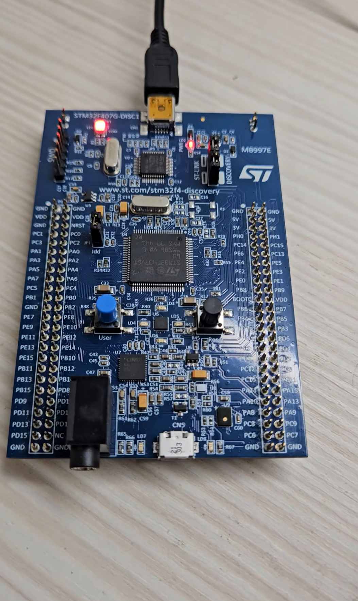

# Timer Polling

## Overview

This lab uses `TIM7` basic timer polling to check the timer update flag every 1 second.

The experiment uses `TIM7` to generate a periodic update event.  
Instead of using timer interrupt, the program continuously checks the update flag in `while(1)`.

When the update flag is set, STM32 toggles the LEDs connected to `PD12`, `PD13`, `PD14`, and `PD15`.

The main purpose of this lab is to observe the relationship between:

- Basic Timer
- Timer clock
- Prescaler (PSC)
- Auto-reload register (ARR)
- Update event
- Update flag
- Timer polling

In this lab, the external high-speed clock `HSE = 8 MHz` is used as the system clock source.

## Demo

This demo shows:

- TIM7 generates an update event every 1 second
- The program checks `TIM_FLAG_UPDATE` in `while(1)`
- LEDs toggle every second
- The update flag must be cleared manually after polling

[Watch the demo video](YOUR_DEMO_VIDEO_LINK)

<a href="YOUR_DEMO_VIDEO_LINK">
  
</a>

## Board / Tool

- STM32F407G-DISC1
- MCU: STM32F407VGT6U
- IDE: Keil uVision (MDK-ARM)
- Tool: STM32CubeMX
- Debugger / Programmer: ST-LINK

## GPIO Pins

| Pin | Function |
|---|---|
| PD12 | LED |
| PD13 | LED |
| PD14 | LED |
| PD15 | LED |

## Timer Setting

This lab uses `TIM7`.

| Setting | Value |
|---|---:|
| Timer | TIM7 |
| Clock source | HSE |
| Timer clock | 8 MHz |
| Prescaler (PSC) | 7999 |
| Counter Period (ARR) | 999 |
| Counter Mode | Up |
| Auto-reload preload | Enable |
| TIM7 global interrupt | Disable |

## Timer Period Calculation

The timer clock is configured as:

```text
TIM7 clock = 8 MHz = 8,000,000 Hz
```

First, the prescaler divides the timer clock:

```text
CK_CNT = Timer clock / (PSC + 1)

CK_CNT = 8,000,000 / (7999 + 1)
       = 8,000,000 / 8000
       = 1000 Hz
```

After the prescaler, the counter clock becomes `1000 Hz`.

This means the counter increases once every 1 ms:

```text
1 / 1000 Hz = 0.001 s = 1 ms
```

Next, the auto-reload register is set to:

```text
ARR = 999
```

So the counter counts from `0` to `999`, which is 1000 counts in total:

```text
0 → 1 → 2 → ... → 999
```

Since each count takes 1 ms:

```text
1000 counts × 1 ms = 1000 ms = 1 second
```

Therefore, TIM7 generates an update event every 1 second.

```text
8,000,000 Hz
↓ PSC = 7999, divide by 8000
1,000 Hz
↓ ARR = 999, count 1000 times
1 Hz
```

## Behavior

Assuming all LEDs are initially OFF:

```text
Initial state:
PD12 / PD13 / PD14 / PD15 OFF

After 1 second:
PD12 / PD13 / PD14 / PD15 ON

After 2 seconds:
PD12 / PD13 / PD14 / PD15 OFF

After 3 seconds:
PD12 / PD13 / PD14 / PD15 ON

After 4 seconds:
PD12 / PD13 / PD14 / PD15 OFF
```

Then the same pattern repeats.

## Core Logic

TIM7 is started in polling mode using `HAL_TIM_Base_Start()`.

```c
/* USER CODE BEGIN 2 */
TIM_TypeDef* TIM_TypeDef_Ptr1;

TIM_TypeDef_Ptr1 = htim7.Instance;
HAL_TIM_Base_Start(&htim7);
/* USER CODE END 2 */
```

The program continuously checks the update flag in `while(1)`.

```c
while (1)
{
    /* USER CODE BEGIN 3 */
    if((TIM_TypeDef_Ptr1->SR & TIM_FLAG_UPDATE) != 0)
    {
        HAL_GPIO_TogglePin(GPIOD, GPIO_PIN_12);
        HAL_GPIO_TogglePin(GPIOD, GPIO_PIN_13);
        HAL_GPIO_TogglePin(GPIOD, GPIO_PIN_14);
        HAL_GPIO_TogglePin(GPIOD, GPIO_PIN_15);

        __HAL_TIM_CLEAR_FLAG(&htim7, TIM_FLAG_UPDATE);
    }
    /* USER CODE END 3 */
}
```

## Explanation

`HAL_TIM_Base_Start(&htim7)` starts TIM7 without interrupt mode.

After this function is called, TIM7 starts counting based on the configured prescaler and auto-reload value.

```text
TIM7 starts counting
↓
CNT counts from 0 to ARR
↓
Update event occurs
↓
TIM_FLAG_UPDATE is set
↓
while(1) checks the flag
↓
LEDs are toggled
↓
Update flag is cleared
```

The following condition checks whether the update flag is set:

```c
if((TIM_TypeDef_Ptr1->SR & TIM_FLAG_UPDATE) != 0)
```

If the flag is set, it means TIM7 has reached the configured period.

After handling the event, the flag must be cleared manually:

```c
__HAL_TIM_CLEAR_FLAG(&htim7, TIM_FLAG_UPDATE);
```

If the update flag is not cleared, the program will keep entering the `if` statement and the LEDs will toggle very quickly instead of once per second.

## Timer Polling vs Timer Interrupt

Timer polling and timer interrupt use similar timer settings, but they handle the update event differently.

| Item | Timer Polling | Timer Interrupt |
|---|---|---|
| Start function | `HAL_TIM_Base_Start()` | `HAL_TIM_Base_Start_IT()` |
| TIM7 global interrupt | Disable | Enable |
| Event handling | Check update flag in `while(1)` | Enter callback function |
| Callback used | No | `HAL_TIM_PeriodElapsedCallback()` |
| Clear flag manually | Yes | Handled in HAL IRQ flow |

In polling mode:

```text
CPU continuously checks the timer flag.
```

In interrupt mode:

```text
Hardware interrupt notifies the CPU when the timer period is reached.
```

## Main Concepts

- Basic Timer
- TIM7
- Timer clock
- HSE clock source
- Prescaler (PSC)
- Auto-reload register (ARR)
- Update event
- Update flag
- Timer polling
- `HAL_TIM_Base_Start()`
- `TIM_FLAG_UPDATE`
- `__HAL_TIM_CLEAR_FLAG()`

## Note

This lab uses polling to check the timer update flag.

Polling is simple and easy to understand, but the CPU must continuously check the flag in `while(1)`.

For periodic tasks that do not need constant CPU checking, timer interrupt is usually more efficient.
