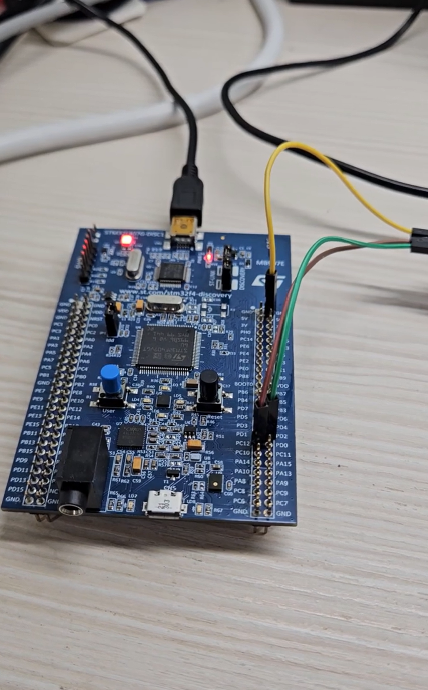

# IWDG Watchdog

## Overview

This lab demonstrates how to use the STM32 Independent Watchdog (IWDG) to reset the MCU when the program does not refresh the watchdog in time.

The IWDG works like a hardware down-counter.
When the program is running normally, it must periodically refresh the watchdog counter.

If the program gets stuck in a loop, a function, or takes too long to execute, the watchdog counter will continue counting down.
When the counter reaches 0, the IWDG triggers an MCU reset.

In this experiment, UART5 is used to print messages to the computer, so the reset behavior can be observed in a serial terminal.

The main purpose of this lab is to understand the relationship between:

* Independent Watchdog
* LSI clock
* Prescaler
* Reload value
* Watchdog refresh
* MCU reset
* UART output

## Demo

This demo shows:

* Starting the IWDG
* Refreshing the IWDG periodically
* Observing that the MCU does not reset when the refresh interval is shorter than the timeout
* Changing the delay time to exceed the watchdog timeout
* Observing the MCU reset through UART output

[Watch the demo video](YOUR_VIDEO_LINK_HERE)

<a href="YOUR_VIDEO_LINK_HERE">
  
</a>

## Board / Tool

* STM32F407G-DISC1
* MCU: STM32F407VGT6U
* IDE: Keil uVision (MDK-ARM)
* Tool: STM32CubeMX
* Debugger / Programmer: ST-LINK

## UART Pins

| Pin  | Function |
| ---- | -------- |
| PC12 | UART5_TX |
| PD2  | UART5_RX |

UART5 is used to send messages to the computer.

The UART setting is:

```text
115200, 8N1
```

## IWDG Setting

| Item | Setting |
| ---- | ------- |
| Watchdog | IWDG |
| Clock source | LSI |
| LSI frequency | 32 kHz |
| Prescaler | 32 |
| Reload value | 999 |

The IWDG uses the LSI clock as its clock source.

In this experiment:

```text
LSI = 32 kHz = 32000 Hz
Prescaler = 32
Reload value = 999
```

After the prescaler, the IWDG counter clock becomes:

```text
32000 / 32 = 1000 Hz
```

This means the IWDG counter counts once every:

```text
1 / 1000 Hz = 1 ms
```

Since the reload value is set to 999, the counter counts approximately 1000 times:

```text
999 → 998 → ... → 0
```

Therefore, the IWDG timeout is approximately:

```text
1000 × 1 ms = 1000 ms = 1 second
```

It can also be calculated by:

```text
Timeout ≈ (Reload value + 1) × Prescaler / LSI frequency

Timeout ≈ (999 + 1) × 32 / 32000
Timeout ≈ 1 second
```

This means that if the program does not refresh the watchdog within about 1 second, the MCU will be reset.

## Main Concepts

* IWDG is an independent watchdog timer
* IWDG uses the LSI low-speed internal clock
* The watchdog counter counts down
* `HAL_IWDG_Refresh()` reloads the watchdog counter
* If the counter reaches 0, the MCU is reset
* UART5 is used to observe whether the MCU restarts

## Behavior

Normal case:

```text
Program starts
↓
UART prints Start!
↓
Program enters while(1)
↓
UART prints Refreshes IWDG!
↓
HAL_IWDG_Refresh() refreshes the watchdog
↓
Delay 800 ms
↓
Repeat
```

Since the watchdog timeout is about 1 second and the delay is only 800 ms, the program refreshes the watchdog before timeout.

Therefore, the MCU does not reset.

Serial terminal output:

```text
Start!
Refreshes IWDG!
Refreshes IWDG!
Refreshes IWDG!
Refreshes IWDG!
...
```

Reset case:

If the delay is changed to 1200 ms:

```text
HAL_Delay(1200);
```

The delay becomes longer than the watchdog timeout.

```text
Program refreshes IWDG
↓
Program delays for 1200 ms
↓
IWDG timeout is about 1000 ms
↓
Watchdog counter reaches 0
↓
MCU reset
↓
Program starts again
```

Serial terminal output:

```text
Start!
Refreshes IWDG!
Start!
Refreshes IWDG!
Start!
Refreshes IWDG!
...
```

The repeated `Start!` message means that the MCU is being reset by the IWDG.

## Core Logic

```c
#include "string.h"

char start[] = "Start!\r\n";
char refresh[] = "Refreshes IWDG!\r\n";

HAL_UART_Transmit(&huart5, (uint8_t *)start, strlen(start), 10);

while (1)
{
    HAL_UART_Transmit(&huart5, (uint8_t *)refresh, strlen(refresh), 10);

    HAL_IWDG_Refresh(&hiwdg);

    HAL_Delay(800);
}
```

## Explanation

`HAL_UART_Transmit()` is used to print messages through UART5.

At the beginning of the program, the MCU sends:

```text
Start!
```

This message is printed only when the program starts or restarts.

Inside the infinite loop, the MCU sends:

```text
Refreshes IWDG!
```

Then the program calls:

```c
HAL_IWDG_Refresh(&hiwdg);
```

This function refreshes the IWDG counter.

Refreshing the watchdog means reloading the down-counter before it reaches 0.

```text
HAL_IWDG_Refresh()
↓
Reload watchdog counter
↓
Prevent watchdog reset
```

After refreshing the watchdog, the program delays for 800 ms:

```c
HAL_Delay(800);
```

Because the IWDG timeout is approximately 1 second, the program can return to the next loop and refresh the watchdog again before timeout.

## IWDG Flow

```text
Program starts
↓
IWDG is initialized
↓
UART prints Start!
↓
Enter while(1)
↓
UART prints Refreshes IWDG!
↓
Refresh IWDG counter
↓
Delay 800 ms
↓
Repeat
```

## Timeout Test Flow

```text
Change delay from 800 ms to 1200 ms
↓
Program refreshes IWDG
↓
Program delays too long
↓
IWDG counter reaches 0
↓
MCU reset
↓
Program restarts
↓
UART prints Start! again
```

## Note

This lab uses IWDG to demonstrate a basic watchdog reset mechanism.

IWDG is useful when the program may get stuck or stop running normally.
If the program does not refresh the watchdog within the timeout period, the MCU will automatically reset.

In real applications, the watchdog should be refreshed only after the important tasks have completed successfully.
This makes sure that the watchdog really checks whether the main program is running correctly.
